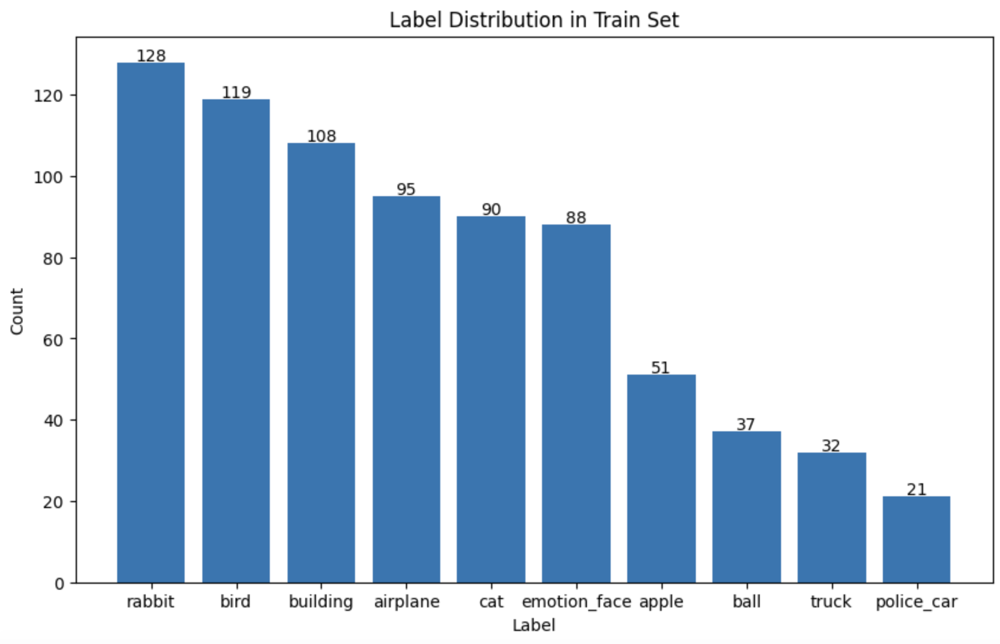

## 대회 주제
아이콘 이미지를 분류하는 AI 알고리즘을 개발하는 것이다.
```python
import pandas as pd
import numpy as np
import matplotlib.pyplot as plt
import torch
from xgboost import XGBClassifier
from sklearn.preprocessing import LabelEncoder
from sklearn.model_selection import train_test_split
from sklearn.metrics import accuracy_score
import cv2
from tqdm import tqdm
```

## EDA(Exploratory Data Analysis)
#### Data Shape
train.csv 파일 0열에는 ID, 1열에는 label, 2열 이후로는 이미지의 픽셀 데이터 정보가 들어가 있다.
test.csv 파일 0열에는 ID, 1열 이후로는 이미지의 픽셀 데이터 정보가 들어가 있다.
이미지 데이터는 32x32 Grayscale 이미지를 flatten 한 1D array 형태를 하고 있다.(데이콘 제공)

#### Image appearance
sadas

#### Check Distribution of Train Data
```python
train = pd.read_csv('train.csv')
test = pd.read_csv('test.csv')

train_distribution = train['label'].value_counts()

plt.figure(figsize=(10, 6))
plt.bar(train_distribution.index, train_distribution.values)
plt.xlabel('Label')
plt.ylabel('Count')
plt.title('Label Distribution in Train Set')
for i in range(len(train_distribution)):
    plt.text(i, train_distribution.values[i]+0.5, str(train_distribution.values[i]), ha='center')
plt.show()
```

데이터 분포를 확인해봤더니 불균형이 심한 것을 알게 되었다. 불균형을 먼저 가장 큰 수인 128에 맞춰 다른 label의 데이터들을 증강시키기로 결정했다. 사실 이 단계는 증강이라고 하기에는 샘플링 해서 복사하는 것이기 때문에 불균형 해소 정도만 수행했다고 볼 수 있다.


## Data Preprocessing
#### Crop Images of Rabbit and Cat
```python
num_features = train.iloc[:, 2:].shape[1]
img_size = int(np.sqrt(num_features))
```
이미지의 사이즈를 측정해 변수로 저장해둔다.

```python
cat_rabbit_df = train[train['label'].isin(['cat', 'rabbit'])]
original_cat_rabbit = cat_rabbit_df.copy()

cat_count = len(train[train['label'] == 'cat'])
rabbit_count = len(train[train['label'] == 'rabbit'])
cat_augment_count = int(cat_count * 0.1)
rabbit_augment_count = int(rabbit_count * 0.1)
```
증강할 토끼와 고양이의 이미지 데이터셋을 추출하고, 각각의 증강 비율(개수)을 설정해준다.

```python
cat_to_augment = train[train['label'] == 'cat'].sample(n=cat_augment_count, random_state=42)
rabbit_to_augment = train[train['label'] == 'rabbit'].sample(n=rabbit_augment_count, random_state=42)
to_augment = pd.concat([cat_to_augment, rabbit_to_augment])
print(f"고양이 이미지 {cat_augment_count}개, 토끼 이미지 {rabbit_augment_count}개를 증강합니다.")
```
확대 및 크롭 작업을 할 이미지를 샘플링한다.

```python
augmented_rows = []
for idx, row in tqdm(to_augment.iterrows(), total=len(to_augment), desc="고양이/토끼 이미지 증강"):
    img_data = row.iloc[2:].values
    img = img_data.reshape(img_size, img_size).astype(np.float32)

    zoom_factor = 1.3
    zoomed_size = int(img_size * zoom_factor)
    zoomed_img = cv2.resize(img, (zoomed_size, zoomed_size), interpolation=cv2.INTER_LINEAR)

    crop_start = (zoomed_size - img_size) // 2
    crop_end = crop_start + img_size
    cropped_img = zoomed_img[crop_start:crop_end, crop_start:crop_end]

    augmented_img_data = cropped_img.flatten()

    new_row = row.copy()
    new_row.iloc[2:] = augmented_img_data

    augmented_rows.append(new_row)

augmented_df = pd.DataFrame(augmented_rows, columns=train.columns)

train = pd.concat([train, augmented_df], ignore_index=True)
print(f"증강 후 총 데이터 수: {len(train)}")
```
고양이 이미지 9개, 토끼 이미지 12개를 증강합니다.
고양이/토끼 이미지 증강: 100%|██████████| 21/21 [00:00<00:00, 3122.42it/s]증강 후 총 데이터 수: 790

확대 비율(zoom_factor)은 1.3배로 하고, 중앙 부분을 크롭하는 방식을 통해 증강을 했다. 이를 통해 토끼와 고양이를 헷갈려하던 모델에게 각각의 얼굴을 보고 학습을 더 할 수 있도록 했다.

```python
for lab in train['label']:
    tmp_df = train[train['label'] == lab]
    tmp_n = len(train[train['label']=='rabbit'])-len(tmp_df)
    if tmp_n > len(train[train['label']=='rabbit'])//2:
        train = pd.concat([train, tmp_df.sample(n=tmp_n, replace=True)])
    else:
        train = pd.concat([train, tmp_df.sample(n=tmp_n)])

train_distribution2 = train['label'].value_counts()

plt.figure(figsize=(10, 6))
plt.bar(train_distribution2.index, train_distribution2.values)
plt.xlabel('Label')
plt.ylabel('Count')
plt.title('Label Distribution in Train Set')
for i in range(len(train_distribution2)):
    plt.text(i, train_distribution2.values[i]+0.5, str(train_distribution2.values[i]), ha='center')
plt.show()
```

이후 데이터의 개수가 가장 많은 label을 기준으로 개수를 맞춰 복사하는 방식의 업샘플링을 통해 데이터 불균형을 해결했다.

#### Seperate Target & Label Encoding
```python
X = train.iloc[:, 2:].values
y = train["label"].values
X_test = test.iloc[:, 1:].values

label_encoder = LabelEncoder()
y = label_encoder.fit_transform(y)
```
먼저 훈련 타겟인 이미지 픽셀 데이터와 답지인 라벨을 각각 X 와 y 로 분리하고, 라벨은 라벨인코더를 통해 인코딩했다.

#### Data Augmentation
```python
def augment_images(X, y, img_size, n_augments=3):
    X_augmented = X.copy()
    y_augmented = y.copy()

    for i in tqdm(range(len(X))):
        img = X[i].reshape(img_size, img_size).astype(np.uint8)

        for j in range(n_augments):
            augmented_img = img.copy()

            # # 밝기 조정 (0.8-1.2 범위)
            # if np.random.random() > 0.5:
            #     brightness_factor = np.random.uniform(0.9, 1.1)
            #     augmented_img = np.clip(augmented_img * brightness_factor, 0, 255).astype(np.uint8)

            # 이미지 이동
            if np.random.random() > 0.5:
                tx, ty = np.random.randint(-3, 2, 2)
                M = np.float32([[1, 0, tx], [0, 1, ty]])
                augmented_img = cv2.warpAffine(augmented_img, M, (img_size, img_size))

            # 가우시안 노이즈 추가
            if np.random.random() > 0.5:
                noise = np.random.normal(0, 10, (img_size, img_size)).astype(np.uint8)
                augmented_img = np.clip(augmented_img + noise, 0, 255).astype(np.uint8)

            # 증강된 이미지를 다시 1D로 변환
            X_augmented = np.vstack([X_augmented, augmented_img.flatten()])
            y_augmented = np.append(y_augmented, y[i])
    return X_augmented, y_augmented

print("데이터 증강 적용 중...")
X_augmented, y_augmented = augment_images(X, y, img_size, n_augments=11)
print(f"원본 데이터 크기: {len(X)}, 증강 후 데이터 크기: {len(X_augmented)}")


X_train, X_valid, y_train, y_valid = train_test_split(
    X_augmented, y_augmented, test_size=0.2, random_state=42, stratify=y_augmented
)
```
데이터 증강 적용 중...
100%|██████████| 1280/1280 [03:54<00:00,  5.46it/s]원본 데이터 크기: 1280, 증강 후 데이터 크기: 14080

데이터 불균형을 해소했으니, 증강을 할 차례이다. 평행 이동, 가우시안 노이즈 추가 이 두 가지의 방법을 사용했다. 회전은 제출 시 점수가 떨어지는 것을 보고 제거했더니 오히려 점수가 올라서 코드에서 아예 지웠고, 밝기 조정은 강도를 약하게 하면 의미가 있을 것이라는 생각이 아직 남아있어서 주석처리만 해놓았다. 증강률(n_augmented)은 다양하게 시도를 해보았지만 현재 리더보드상 가장 높은 점수는 증강률을 11로 했을 때가 0.96으로 좋았다.


## Train
```python
model = XGBClassifier(
    n_estimators=20000,
    learning_rate=0.08,
    max_depth=5,
    random_state=42,
    eval_metric='mlogloss',
    early_stopping_rounds=100,
    eta=0.01,
    tree_method='gpu_hist')

print("모델 학습 중...")
model.fit(
    X_train, y_train,
    eval_set=[(X_train, y_train), (X_valid, y_valid)],
    verbose=True)
```
모델 학습 중...
/usr/local/lib/python3.11/dist-packages/xgboost/core.py:158: UserWarning: [07:27:15] WARNING: /workspace/src/common/error_msg.cc:27: The tree method `gpu_hist` is deprecated since 2.0.0. To use GPU training, set the `device` parameter to CUDA instead.

    E.g. tree_method = "hist", device = "cuda"

  warnings.warn(smsg, UserWarning)
[0]	validation_0-mlogloss:2.13904	validation_1-mlogloss:2.15923
[1]	validation_0-mlogloss:2.00531	validation_1-mlogloss:2.04205
[2]	validation_0-mlogloss:1.89230	validation_1-mlogloss:1.94444
[3]	validation_0-mlogloss:1.79261	validation_1-mlogloss:1.85875
[4]	validation_0-mlogloss:1.70274	validation_1-mlogloss:1.78088
[5]	validation_0-mlogloss:1.62047	validation_1-mlogloss:1.71074
[6]	validation_0-mlogloss:1.54513	validation_1-mlogloss:1.64605
[7]	validation_0-mlogloss:1.47541	validation_1-mlogloss:1.58518
[8]	validation_0-mlogloss:1.41220	validation_1-mlogloss:1.53113
[9]	validation_0-mlogloss:1.35116	validation_1-mlogloss:1.47937
[10]	validation_0-mlogloss:1.29579	validation_1-mlogloss:1.43128
[11]	validation_0-mlogloss:1.24412	validation_1-mlogloss:1.38723
[12]	validation_0-mlogloss:1.19616	validation_1-mlogloss:1.34607
[13]	validation_0-mlogloss:1.14945	validation_1-mlogloss:1.30504
[14]	validation_0-mlogloss:1.10660	validation_1-mlogloss:1.26835
[15]	validation_0-mlogloss:1.06569	validation_1-mlogloss:1.23380
[16]	validation_0-mlogloss:1.02739	validation_1-mlogloss:1.20132
[17]	validation_0-mlogloss:0.99161	validation_1-mlogloss:1.17036
[18]	validation_0-mlogloss:0.95734	validation_1-mlogloss:1.14111
[19]	validation_0-mlogloss:0.92479	validation_1-mlogloss:1.11358
[20]	validation_0-mlogloss:0.89346	validation_1-mlogloss:1.08734
[21]	validation_0-mlogloss:0.86385	validation_1-mlogloss:1.06186
[22]	validation_0-mlogloss:0.83581	validation_1-mlogloss:1.03741
[23]	validation_0-mlogloss:0.80830	validation_1-mlogloss:1.01386
[24]	validation_0-mlogloss:0.78227	validation_1-mlogloss:0.99135
[25]	validation_0-mlogloss:0.75741	validation_1-mlogloss:0.96991
[26]	validation_0-mlogloss:0.73396	validation_1-mlogloss:0.94978
[27]	validation_0-mlogloss:0.71037	validation_1-mlogloss:0.92849
[28]	validation_0-mlogloss:0.68911	validation_1-mlogloss:0.91057
[29]	validation_0-mlogloss:0.66832	validation_1-mlogloss:0.89258
[30]	validation_0-mlogloss:0.64898	validation_1-mlogloss:0.87547
[31]	validation_0-mlogloss:0.63027	validation_1-mlogloss:0.85950
[32]	validation_0-mlogloss:0.61190	validation_1-mlogloss:0.84347
[33]	validation_0-mlogloss:0.59427	validation_1-mlogloss:0.82803
[34]	validation_0-mlogloss:0.57702	validation_1-mlogloss:0.81303
[35]	validation_0-mlogloss:0.56074	validation_1-mlogloss:0.79865
[36]	validation_0-mlogloss:0.54483	validation_1-mlogloss:0.78467
[37]	validation_0-mlogloss:0.52977	validation_1-mlogloss:0.77165
[38]	validation_0-mlogloss:0.51481	validation_1-mlogloss:0.75831
[39]	validation_0-mlogloss:0.50080	validation_1-mlogloss:0.74642
[40]	validation_0-mlogloss:0.48717	validation_1-mlogloss:0.73419
[41]	validation_0-mlogloss:0.47435	validation_1-mlogloss:0.72251
[42]	validation_0-mlogloss:0.46185	validation_1-mlogloss:0.71147
[43]	validation_0-mlogloss:0.44985	validation_1-mlogloss:0.70107
[44]	validation_0-mlogloss:0.43747	validation_1-mlogloss:0.69015
[45]	validation_0-mlogloss:0.42587	validation_1-mlogloss:0.67974
[46]	validation_0-mlogloss:0.41511	validation_1-mlogloss:0.67004
[47]	validation_0-mlogloss:0.40433	validation_1-mlogloss:0.66046
[48]	validation_0-mlogloss:0.39325	validation_1-mlogloss:0.65012
[49]	validation_0-mlogloss:0.38278	validation_1-mlogloss:0.64106
[50]	validation_0-mlogloss:0.37294	validation_1-mlogloss:0.63256
[51]	validation_0-mlogloss:0.36356	validation_1-mlogloss:0.62344
[52]	validation_0-mlogloss:0.35459	validation_1-mlogloss:0.61506
[53]	validation_0-mlogloss:0.34568	validation_1-mlogloss:0.60691
[54]	validation_0-mlogloss:0.33709	validation_1-mlogloss:0.59901
[55]	validation_0-mlogloss:0.32889	validation_1-mlogloss:0.59190
[56]	validation_0-mlogloss:0.32132	validation_1-mlogloss:0.58459
[57]	validation_0-mlogloss:0.31358	validation_1-mlogloss:0.57762
[58]	validation_0-mlogloss:0.30575	validation_1-mlogloss:0.57058
[59]	validation_0-mlogloss:0.29821	validation_1-mlogloss:0.56407
[60]	validation_0-mlogloss:0.29071	validation_1-mlogloss:0.55713
[61]	validation_0-mlogloss:0.28416	validation_1-mlogloss:0.55095
[62]	validation_0-mlogloss:0.27748	validation_1-mlogloss:0.54507
[63]	validation_0-mlogloss:0.27079	validation_1-mlogloss:0.53892
[64]	validation_0-mlogloss:0.26468	validation_1-mlogloss:0.53278
[65]	validation_0-mlogloss:0.25845	validation_1-mlogloss:0.52701
[66]	validation_0-mlogloss:0.25248	validation_1-mlogloss:0.52129
[67]	validation_0-mlogloss:0.24662	validation_1-mlogloss:0.51587
[68]	validation_0-mlogloss:0.24093	validation_1-mlogloss:0.51038
[69]	validation_0-mlogloss:0.23542	validation_1-mlogloss:0.50513
[70]	validation_0-mlogloss:0.23026	validation_1-mlogloss:0.50014
[71]	validation_0-mlogloss:0.22517	validation_1-mlogloss:0.49523
[72]	validation_0-mlogloss:0.22030	validation_1-mlogloss:0.49030
[73]	validation_0-mlogloss:0.21543	validation_1-mlogloss:0.48564
[74]	validation_0-mlogloss:0.21062	validation_1-mlogloss:0.48111
[75]	validation_0-mlogloss:0.20576	validation_1-mlogloss:0.47625
[76]	validation_0-mlogloss:0.20128	validation_1-mlogloss:0.47170
[77]	validation_0-mlogloss:0.19708	validation_1-mlogloss:0.46723
[78]	validation_0-mlogloss:0.19286	validation_1-mlogloss:0.46310
[79]	validation_0-mlogloss:0.18868	validation_1-mlogloss:0.45869
[80]	validation_0-mlogloss:0.18470	validation_1-mlogloss:0.45431
[81]	validation_0-mlogloss:0.18079	validation_1-mlogloss:0.45015
[82]	validation_0-mlogloss:0.17704	validation_1-mlogloss:0.44637
[83]	validation_0-mlogloss:0.17332	validation_1-mlogloss:0.44266
[84]	validation_0-mlogloss:0.16969	validation_1-mlogloss:0.43896
[85]	validation_0-mlogloss:0.16606	validation_1-mlogloss:0.43534
[86]	validation_0-mlogloss:0.16240	validation_1-mlogloss:0.43163
[87]	validation_0-mlogloss:0.15894	validation_1-mlogloss:0.42766
[88]	validation_0-mlogloss:0.15550	validation_1-mlogloss:0.42418
[89]	validation_0-mlogloss:0.15226	validation_1-mlogloss:0.42074
[90]	validation_0-mlogloss:0.14903	validation_1-mlogloss:0.41701
[91]	validation_0-mlogloss:0.14603	validation_1-mlogloss:0.41391
[92]	validation_0-mlogloss:0.14301	validation_1-mlogloss:0.41053
[93]	validation_0-mlogloss:0.14014	validation_1-mlogloss:0.40733
[94]	validation_0-mlogloss:0.13728	validation_1-mlogloss:0.40385
[95]	validation_0-mlogloss:0.13447	validation_1-mlogloss:0.40068
[96]	validation_0-mlogloss:0.13183	validation_1-mlogloss:0.39742
[97]	validation_0-mlogloss:0.12907	validation_1-mlogloss:0.39468
[98]	validation_0-mlogloss:0.12661	validation_1-mlogloss:0.39193
[99]	validation_0-mlogloss:0.12389	validation_1-mlogloss:0.38878
[100]	validation_0-mlogloss:0.12136	validation_1-mlogloss:0.38600
[101]	validation_0-mlogloss:0.11903	validation_1-mlogloss:0.38348
[102]	validation_0-mlogloss:0.11649	validation_1-mlogloss:0.38045
[103]	validation_0-mlogloss:0.11424	validation_1-mlogloss:0.37759
[104]	validation_0-mlogloss:0.11209	validation_1-mlogloss:0.37492
[105]	validation_0-mlogloss:0.10997	validation_1-mlogloss:0.37240
[106]	validation_0-mlogloss:0.10770	validation_1-mlogloss:0.36974
[107]	validation_0-mlogloss:0.10572	validation_1-mlogloss:0.36736
[108]	validation_0-mlogloss:0.10363	validation_1-mlogloss:0.36482
[109]	validation_0-mlogloss:0.10172	validation_1-mlogloss:0.36220
[110]	validation_0-mlogloss:0.09974	validation_1-mlogloss:0.35981
[111]	validation_0-mlogloss:0.09787	validation_1-mlogloss:0.35742
[112]	validation_0-mlogloss:0.09597	validation_1-mlogloss:0.35505
[113]	validation_0-mlogloss:0.09406	validation_1-mlogloss:0.35284
[114]	validation_0-mlogloss:0.09219	validation_1-mlogloss:0.35073
[115]	validation_0-mlogloss:0.09050	validation_1-mlogloss:0.34861
[116]	validation_0-mlogloss:0.08887	validation_1-mlogloss:0.34674
[117]	validation_0-mlogloss:0.08734	validation_1-mlogloss:0.34469
[118]	validation_0-mlogloss:0.08570	validation_1-mlogloss:0.34244
[119]	validation_0-mlogloss:0.08388	validation_1-mlogloss:0.34014
[120]	validation_0-mlogloss:0.08234	validation_1-mlogloss:0.33817
[121]	validation_0-mlogloss:0.08086	validation_1-mlogloss:0.33606
[122]	validation_0-mlogloss:0.07939	validation_1-mlogloss:0.33405
[123]	validation_0-mlogloss:0.07792	validation_1-mlogloss:0.33215
[124]	validation_0-mlogloss:0.07645	validation_1-mlogloss:0.33022
[125]	validation_0-mlogloss:0.07495	validation_1-mlogloss:0.32825
[126]	validation_0-mlogloss:0.07356	validation_1-mlogloss:0.32645
[127]	validation_0-mlogloss:0.07215	validation_1-mlogloss:0.32461
[128]	validation_0-mlogloss:0.07083	validation_1-mlogloss:0.32273
[129]	validation_0-mlogloss:0.06953	validation_1-mlogloss:0.32112
[130]	validation_0-mlogloss:0.06829	validation_1-mlogloss:0.31933
[131]	validation_0-mlogloss:0.06706	validation_1-mlogloss:0.31781
[132]	validation_0-mlogloss:0.06588	validation_1-mlogloss:0.31628
[133]	validation_0-mlogloss:0.06466	validation_1-mlogloss:0.31434
[134]	validation_0-mlogloss:0.06327	validation_1-mlogloss:0.31246
[135]	validation_0-mlogloss:0.06219	validation_1-mlogloss:0.31099
[136]	validation_0-mlogloss:0.06103	validation_1-mlogloss:0.30932
[137]	validation_0-mlogloss:0.06002	validation_1-mlogloss:0.30790
[138]	validation_0-mlogloss:0.05881	validation_1-mlogloss:0.30611
[139]	validation_0-mlogloss:0.05781	validation_1-mlogloss:0.30460
[140]	validation_0-mlogloss:0.05672	validation_1-mlogloss:0.30284
[141]	validation_0-mlogloss:0.05563	validation_1-mlogloss:0.30105
[142]	validation_0-mlogloss:0.05471	validation_1-mlogloss:0.29951
[143]	validation_0-mlogloss:0.05369	validation_1-mlogloss:0.29791
[144]	validation_0-mlogloss:0.05267	validation_1-mlogloss:0.29658
[145]	validation_0-mlogloss:0.05180	validation_1-mlogloss:0.29510
[146]	validation_0-mlogloss:0.05086	validation_1-mlogloss:0.29350
[147]	validation_0-mlogloss:0.04992	validation_1-mlogloss:0.29207
[148]	validation_0-mlogloss:0.04890	validation_1-mlogloss:0.29059
[149]	validation_0-mlogloss:0.04811	validation_1-mlogloss:0.28918
[150]	validation_0-mlogloss:0.04726	validation_1-mlogloss:0.28791
[151]	validation_0-mlogloss:0.04646	validation_1-mlogloss:0.28675
[152]	validation_0-mlogloss:0.04562	validation_1-mlogloss:0.28545
[153]	validation_0-mlogloss:0.04481	validation_1-mlogloss:0.28404
[154]	validation_0-mlogloss:0.04399	validation_1-mlogloss:0.28254
[155]	validation_0-mlogloss:0.04321	validation_1-mlogloss:0.28117
[156]	validation_0-mlogloss:0.04252	validation_1-mlogloss:0.27980
[157]	validation_0-mlogloss:0.04181	validation_1-mlogloss:0.27852
[158]	validation_0-mlogloss:0.04104	validation_1-mlogloss:0.27713
[159]	validation_0-mlogloss:0.04038	validation_1-mlogloss:0.27592
[160]	validation_0-mlogloss:0.03973	validation_1-mlogloss:0.27482
[161]	validation_0-mlogloss:0.03903	validation_1-mlogloss:0.27353
[162]	validation_0-mlogloss:0.03838	validation_1-mlogloss:0.27256
[163]	validation_0-mlogloss:0.03777	validation_1-mlogloss:0.27156
[164]	validation_0-mlogloss:0.03715	validation_1-mlogloss:0.27057
[165]	validation_0-mlogloss:0.03654	validation_1-mlogloss:0.26942
[166]	validation_0-mlogloss:0.03599	validation_1-mlogloss:0.26854
[167]	validation_0-mlogloss:0.03537	validation_1-mlogloss:0.26733
[168]	validation_0-mlogloss:0.03483	validation_1-mlogloss:0.26624
[169]	validation_0-mlogloss:0.03425	validation_1-mlogloss:0.26514
[170]	validation_0-mlogloss:0.03367	validation_1-mlogloss:0.26412
[171]	validation_0-mlogloss:0.03313	validation_1-mlogloss:0.26308
[172]	validation_0-mlogloss:0.03260	validation_1-mlogloss:0.26216
[173]	validation_0-mlogloss:0.03208	validation_1-mlogloss:0.26104
[174]	validation_0-mlogloss:0.03151	validation_1-mlogloss:0.26008
[175]	validation_0-mlogloss:0.03099	validation_1-mlogloss:0.25906
[176]	validation_0-mlogloss:0.03044	validation_1-mlogloss:0.25778
[177]	validation_0-mlogloss:0.02992	validation_1-mlogloss:0.25666
[178]	validation_0-mlogloss:0.02946	validation_1-mlogloss:0.25568
[179]	validation_0-mlogloss:0.02898	validation_1-mlogloss:0.25466
[180]	validation_0-mlogloss:0.02851	validation_1-mlogloss:0.25385
[181]	validation_0-mlogloss:0.02805	validation_1-mlogloss:0.25297
[182]	validation_0-mlogloss:0.02757	validation_1-mlogloss:0.25180
[183]	validation_0-mlogloss:0.02713	validation_1-mlogloss:0.25088
[184]	validation_0-mlogloss:0.02672	validation_1-mlogloss:0.25021
[185]	validation_0-mlogloss:0.02630	validation_1-mlogloss:0.24913
[186]	validation_0-mlogloss:0.02592	validation_1-mlogloss:0.24824
[187]	validation_0-mlogloss:0.02550	validation_1-mlogloss:0.24717
[188]	validation_0-mlogloss:0.02508	validation_1-mlogloss:0.24621
[189]	validation_0-mlogloss:0.02468	validation_1-mlogloss:0.24525
[190]	validation_0-mlogloss:0.02424	validation_1-mlogloss:0.24444
[191]	validation_0-mlogloss:0.02389	validation_1-mlogloss:0.24365
[192]	validation_0-mlogloss:0.02349	validation_1-mlogloss:0.24290
[193]	validation_0-mlogloss:0.02315	validation_1-mlogloss:0.24215
[194]	validation_0-mlogloss:0.02284	validation_1-mlogloss:0.24148
[195]	validation_0-mlogloss:0.02248	validation_1-mlogloss:0.24064
[196]	validation_0-mlogloss:0.02218	validation_1-mlogloss:0.23993
[197]	validation_0-mlogloss:0.02184	validation_1-mlogloss:0.23902
[198]	validation_0-mlogloss:0.02149	validation_1-mlogloss:0.23807
[199]	validation_0-mlogloss:0.02117	validation_1-mlogloss:0.23726
[200]	validation_0-mlogloss:0.02083	validation_1-mlogloss:0.23652
[201]	validation_0-mlogloss:0.02051	validation_1-mlogloss:0.23571
[202]	validation_0-mlogloss:0.02021	validation_1-mlogloss:0.23494
[203]	validation_0-mlogloss:0.01990	validation_1-mlogloss:0.23402
[204]	validation_0-mlogloss:0.01958	validation_1-mlogloss:0.23306
[205]	validation_0-mlogloss:0.01927	validation_1-mlogloss:0.23224
[206]	validation_0-mlogloss:0.01900	validation_1-mlogloss:0.23167
[207]	validation_0-mlogloss:0.01869	validation_1-mlogloss:0.23088
[208]	validation_0-mlogloss:0.01839	validation_1-mlogloss:0.23024
[209]	validation_0-mlogloss:0.01811	validation_1-mlogloss:0.22945
[210]	validation_0-mlogloss:0.01787	validation_1-mlogloss:0.22873
[211]	validation_0-mlogloss:0.01760	validation_1-mlogloss:0.22804
[212]	validation_0-mlogloss:0.01733	validation_1-mlogloss:0.22735
[213]	validation_0-mlogloss:0.01705	validation_1-mlogloss:0.22668
[214]	validation_0-mlogloss:0.01681	validation_1-mlogloss:0.22594
[215]	validation_0-mlogloss:0.01656	validation_1-mlogloss:0.22519
[216]	validation_0-mlogloss:0.01634	validation_1-mlogloss:0.22471
[217]	validation_0-mlogloss:0.01611	validation_1-mlogloss:0.22403
[218]	validation_0-mlogloss:0.01588	validation_1-mlogloss:0.22356
[219]	validation_0-mlogloss:0.01567	validation_1-mlogloss:0.22291
[220]	validation_0-mlogloss:0.01546	validation_1-mlogloss:0.22226
[221]	validation_0-mlogloss:0.01524	validation_1-mlogloss:0.22165
[222]	validation_0-mlogloss:0.01503	validation_1-mlogloss:0.22121
[223]	validation_0-mlogloss:0.01479	validation_1-mlogloss:0.22043
[224]	validation_0-mlogloss:0.01461	validation_1-mlogloss:0.21984
[225]	validation_0-mlogloss:0.01442	validation_1-mlogloss:0.21913
[226]	validation_0-mlogloss:0.01423	validation_1-mlogloss:0.21852
[227]	validation_0-mlogloss:0.01404	validation_1-mlogloss:0.21807
[228]	validation_0-mlogloss:0.01385	validation_1-mlogloss:0.21756
[229]	validation_0-mlogloss:0.01367	validation_1-mlogloss:0.21705
[230]	validation_0-mlogloss:0.01350	validation_1-mlogloss:0.21654
[231]	validation_0-mlogloss:0.01334	validation_1-mlogloss:0.21609
[232]	validation_0-mlogloss:0.01316	validation_1-mlogloss:0.21543
[233]	validation_0-mlogloss:0.01298	validation_1-mlogloss:0.21480
[234]	validation_0-mlogloss:0.01282	validation_1-mlogloss:0.21438
[235]	validation_0-mlogloss:0.01266	validation_1-mlogloss:0.21395
[236]	validation_0-mlogloss:0.01249	validation_1-mlogloss:0.21340
[237]	validation_0-mlogloss:0.01233	validation_1-mlogloss:0.21286
[238]	validation_0-mlogloss:0.01217	validation_1-mlogloss:0.21239
[239]	validation_0-mlogloss:0.01202	validation_1-mlogloss:0.21195
[240]	validation_0-mlogloss:0.01186	validation_1-mlogloss:0.21142
[241]	validation_0-mlogloss:0.01173	validation_1-mlogloss:0.21103
[242]	validation_0-mlogloss:0.01158	validation_1-mlogloss:0.21063
[243]	validation_0-mlogloss:0.01144	validation_1-mlogloss:0.21013
[244]	validation_0-mlogloss:0.01130	validation_1-mlogloss:0.20975
[245]	validation_0-mlogloss:0.01116	validation_1-mlogloss:0.20924
[246]	validation_0-mlogloss:0.01102	validation_1-mlogloss:0.20880
[247]	validation_0-mlogloss:0.01089	validation_1-mlogloss:0.20835
[248]	validation_0-mlogloss:0.01076	validation_1-mlogloss:0.20786
[249]	validation_0-mlogloss:0.01063	validation_1-mlogloss:0.20752
[250]	validation_0-mlogloss:0.01051	validation_1-mlogloss:0.20711
[251]	validation_0-mlogloss:0.01037	validation_1-mlogloss:0.20669
[252]	validation_0-mlogloss:0.01024	validation_1-mlogloss:0.20625
[253]	validation_0-mlogloss:0.01013	validation_1-mlogloss:0.20586
[254]	validation_0-mlogloss:0.01001	validation_1-mlogloss:0.20544
[255]	validation_0-mlogloss:0.00989	validation_1-mlogloss:0.20514
[256]	validation_0-mlogloss:0.00978	validation_1-mlogloss:0.20474
[257]	validation_0-mlogloss:0.00966	validation_1-mlogloss:0.20432
[258]	validation_0-mlogloss:0.00956	validation_1-mlogloss:0.20401
[259]	validation_0-mlogloss:0.00944	validation_1-mlogloss:0.20354
[260]	validation_0-mlogloss:0.00934	validation_1-mlogloss:0.20327
[261]	validation_0-mlogloss:0.00924	validation_1-mlogloss:0.20303
[262]	validation_0-mlogloss:0.00913	validation_1-mlogloss:0.20265
[263]	validation_0-mlogloss:0.00903	validation_1-mlogloss:0.20219
[264]	validation_0-mlogloss:0.00892	validation_1-mlogloss:0.20191
[265]	validation_0-mlogloss:0.00882	validation_1-mlogloss:0.20157
[266]	validation_0-mlogloss:0.00870	validation_1-mlogloss:0.20116
[267]	validation_0-mlogloss:0.00860	validation_1-mlogloss:0.20083
[268]	validation_0-mlogloss:0.00850	validation_1-mlogloss:0.20039
[269]	validation_0-mlogloss:0.00841	validation_1-mlogloss:0.19999
[270]	validation_0-mlogloss:0.00832	validation_1-mlogloss:0.19959
[271]	validation_0-mlogloss:0.00823	validation_1-mlogloss:0.19908
[272]	validation_0-mlogloss:0.00815	validation_1-mlogloss:0.19876
[273]	validation_0-mlogloss:0.00805	validation_1-mlogloss:0.19829
[274]	validation_0-mlogloss:0.00797	validation_1-mlogloss:0.19802
[275]	validation_0-mlogloss:0.00789	validation_1-mlogloss:0.19764
[276]	validation_0-mlogloss:0.00780	validation_1-mlogloss:0.19734
[277]	validation_0-mlogloss:0.00771	validation_1-mlogloss:0.19703
[278]	validation_0-mlogloss:0.00763	validation_1-mlogloss:0.19658
[279]	validation_0-mlogloss:0.00755	validation_1-mlogloss:0.19616
[280]	validation_0-mlogloss:0.00747	validation_1-mlogloss:0.19582
[281]	validation_0-mlogloss:0.00739	validation_1-mlogloss:0.19546
[282]	validation_0-mlogloss:0.00730	validation_1-mlogloss:0.19517
[283]	validation_0-mlogloss:0.00724	validation_1-mlogloss:0.19485
[284]	validation_0-mlogloss:0.00716	validation_1-mlogloss:0.19461
[285]	validation_0-mlogloss:0.00709	validation_1-mlogloss:0.19423
[286]	validation_0-mlogloss:0.00703	validation_1-mlogloss:0.19377
[287]	validation_0-mlogloss:0.00696	validation_1-mlogloss:0.19338
[288]	validation_0-mlogloss:0.00689	validation_1-mlogloss:0.19321
[289]	validation_0-mlogloss:0.00682	validation_1-mlogloss:0.19293
[290]	validation_0-mlogloss:0.00676	validation_1-mlogloss:0.19260
[291]	validation_0-mlogloss:0.00669	validation_1-mlogloss:0.19234
[292]	validation_0-mlogloss:0.00663	validation_1-mlogloss:0.19209
[293]	validation_0-mlogloss:0.00656	validation_1-mlogloss:0.19178
[294]	validation_0-mlogloss:0.00650	validation_1-mlogloss:0.19150
[295]	validation_0-mlogloss:0.00644	validation_1-mlogloss:0.19134
[296]	validation_0-mlogloss:0.00637	validation_1-mlogloss:0.19103
[297]	validation_0-mlogloss:0.00631	validation_1-mlogloss:0.19070
[298]	validation_0-mlogloss:0.00625	validation_1-mlogloss:0.19045
[299]	validation_0-mlogloss:0.00619	validation_1-mlogloss:0.19018
[300]	validation_0-mlogloss:0.00613	validation_1-mlogloss:0.18988
[301]	validation_0-mlogloss:0.00608	validation_1-mlogloss:0.18960
[302]	validation_0-mlogloss:0.00602	validation_1-mlogloss:0.18930
[303]	validation_0-mlogloss:0.00596	validation_1-mlogloss:0.18899
[304]	validation_0-mlogloss:0.00590	validation_1-mlogloss:0.18871
[305]	validation_0-mlogloss:0.00585	validation_1-mlogloss:0.18854
[306]	validation_0-mlogloss:0.00580	validation_1-mlogloss:0.18816
[307]	validation_0-mlogloss:0.00575	validation_1-mlogloss:0.18798
[308]	validation_0-mlogloss:0.00570	validation_1-mlogloss:0.18768
[309]	validation_0-mlogloss:0.00565	validation_1-mlogloss:0.18735
[310]	validation_0-mlogloss:0.00559	validation_1-mlogloss:0.18699
[311]	validation_0-mlogloss:0.00554	validation_1-mlogloss:0.18674
[312]	validation_0-mlogloss:0.00549	validation_1-mlogloss:0.18643
[313]	validation_0-mlogloss:0.00544	validation_1-mlogloss:0.18606
[314]	validation_0-mlogloss:0.00540	validation_1-mlogloss:0.18583
[315]	validation_0-mlogloss:0.00535	validation_1-mlogloss:0.18563
[316]	validation_0-mlogloss:0.00531	validation_1-mlogloss:0.18533
[317]	validation_0-mlogloss:0.00526	validation_1-mlogloss:0.18498
[318]	validation_0-mlogloss:0.00522	validation_1-mlogloss:0.18468
[319]	validation_0-mlogloss:0.00518	validation_1-mlogloss:0.18443
[320]	validation_0-mlogloss:0.00514	validation_1-mlogloss:0.18422
[321]	validation_0-mlogloss:0.00509	validation_1-mlogloss:0.18391
[322]	validation_0-mlogloss:0.00506	validation_1-mlogloss:0.18363
[323]	validation_0-mlogloss:0.00501	validation_1-mlogloss:0.18341
[324]	validation_0-mlogloss:0.00497	validation_1-mlogloss:0.18318
[325]	validation_0-mlogloss:0.00493	validation_1-mlogloss:0.18298
[326]	validation_0-mlogloss:0.00489	validation_1-mlogloss:0.18276
[327]	validation_0-mlogloss:0.00485	validation_1-mlogloss:0.18260
[328]	validation_0-mlogloss:0.00481	validation_1-mlogloss:0.18249
[329]	validation_0-mlogloss:0.00477	validation_1-mlogloss:0.18237
[330]	validation_0-mlogloss:0.00474	validation_1-mlogloss:0.18205
[331]	validation_0-mlogloss:0.00470	validation_1-mlogloss:0.18180
[332]	validation_0-mlogloss:0.00466	validation_1-mlogloss:0.18164
[333]	validation_0-mlogloss:0.00462	validation_1-mlogloss:0.18142
[334]	validation_0-mlogloss:0.00459	validation_1-mlogloss:0.18125
[335]	validation_0-mlogloss:0.00455	validation_1-mlogloss:0.18103
[336]	validation_0-mlogloss:0.00451	validation_1-mlogloss:0.18083
[337]	validation_0-mlogloss:0.00448	validation_1-mlogloss:0.18062
[338]	validation_0-mlogloss:0.00444	validation_1-mlogloss:0.18040
[339]	validation_0-mlogloss:0.00441	validation_1-mlogloss:0.18011
[340]	validation_0-mlogloss:0.00437	validation_1-mlogloss:0.17992
[341]	validation_0-mlogloss:0.00434	validation_1-mlogloss:0.17969
[342]	validation_0-mlogloss:0.00431	validation_1-mlogloss:0.17957
[343]	validation_0-mlogloss:0.00428	validation_1-mlogloss:0.17943
[344]	validation_0-mlogloss:0.00424	validation_1-mlogloss:0.17927
[345]	validation_0-mlogloss:0.00421	validation_1-mlogloss:0.17909
[346]	validation_0-mlogloss:0.00418	validation_1-mlogloss:0.17887
[347]	validation_0-mlogloss:0.00415	validation_1-mlogloss:0.17869
[348]	validation_0-mlogloss:0.00412	validation_1-mlogloss:0.17849
[349]	validation_0-mlogloss:0.00409	validation_1-mlogloss:0.17824
[350]	validation_0-mlogloss:0.00406	validation_1-mlogloss:0.17814
[351]	validation_0-mlogloss:0.00403	validation_1-mlogloss:0.17794
[352]	validation_0-mlogloss:0.00400	validation_1-mlogloss:0.17776
[353]	validation_0-mlogloss:0.00397	validation_1-mlogloss:0.17757
[354]	validation_0-mlogloss:0.00395	validation_1-mlogloss:0.17734
[355]	validation_0-mlogloss:0.00392	validation_1-mlogloss:0.17721
[356]	validation_0-mlogloss:0.00389	validation_1-mlogloss:0.17701
[357]	validation_0-mlogloss:0.00386	validation_1-mlogloss:0.17684
[358]	validation_0-mlogloss:0.00383	validation_1-mlogloss:0.17666
[359]	validation_0-mlogloss:0.00381	validation_1-mlogloss:0.17651
[360]	validation_0-mlogloss:0.00378	validation_1-mlogloss:0.17643
[361]	validation_0-mlogloss:0.00375	validation_1-mlogloss:0.17624
[362]	validation_0-mlogloss:0.00373	validation_1-mlogloss:0.17594
[363]	validation_0-mlogloss:0.00370	validation_1-mlogloss:0.17582
[364]	validation_0-mlogloss:0.00368	validation_1-mlogloss:0.17579
[365]	validation_0-mlogloss:0.00365	validation_1-mlogloss:0.17578
[366]	validation_0-mlogloss:0.00363	validation_1-mlogloss:0.17562
[367]	validation_0-mlogloss:0.00361	validation_1-mlogloss:0.17544
[368]	validation_0-mlogloss:0.00359	validation_1-mlogloss:0.17529
[369]	validation_0-mlogloss:0.00356	validation_1-mlogloss:0.17519
[370]	validation_0-mlogloss:0.00354	validation_1-mlogloss:0.17497
[371]	validation_0-mlogloss:0.00351	validation_1-mlogloss:0.17476
[372]	validation_0-mlogloss:0.00349	validation_1-mlogloss:0.17459
[373]	validation_0-mlogloss:0.00347	validation_1-mlogloss:0.17446
[374]	validation_0-mlogloss:0.00345	validation_1-mlogloss:0.17427
[375]	validation_0-mlogloss:0.00343	validation_1-mlogloss:0.17413
[376]	validation_0-mlogloss:0.00341	validation_1-mlogloss:0.17400
[377]	validation_0-mlogloss:0.00338	validation_1-mlogloss:0.17388
[378]	validation_0-mlogloss:0.00336	validation_1-mlogloss:0.17372
[379]	validation_0-mlogloss:0.00334	validation_1-mlogloss:0.17372
[380]	validation_0-mlogloss:0.00332	validation_1-mlogloss:0.17349
[381]	validation_0-mlogloss:0.00330	validation_1-mlogloss:0.17332
[382]	validation_0-mlogloss:0.00328	validation_1-mlogloss:0.17311
[383]	validation_0-mlogloss:0.00326	validation_1-mlogloss:0.17299
[384]	validation_0-mlogloss:0.00324	validation_1-mlogloss:0.17282
[385]	validation_0-mlogloss:0.00322	validation_1-mlogloss:0.17282
[386]	validation_0-mlogloss:0.00320	validation_1-mlogloss:0.17275
[387]	validation_0-mlogloss:0.00318	validation_1-mlogloss:0.17262
[388]	validation_0-mlogloss:0.00317	validation_1-mlogloss:0.17250
[389]	validation_0-mlogloss:0.00315	validation_1-mlogloss:0.17237
[390]	validation_0-mlogloss:0.00313	validation_1-mlogloss:0.17228
[391]	validation_0-mlogloss:0.00311	validation_1-mlogloss:0.17214
[392]	validation_0-mlogloss:0.00309	validation_1-mlogloss:0.17200
[393]	validation_0-mlogloss:0.00307	validation_1-mlogloss:0.17187
[394]	validation_0-mlogloss:0.00306	validation_1-mlogloss:0.17178
[395]	validation_0-mlogloss:0.00304	validation_1-mlogloss:0.17164
[396]	validation_0-mlogloss:0.00302	validation_1-mlogloss:0.17148
[397]	validation_0-mlogloss:0.00301	validation_1-mlogloss:0.17145
[398]	validation_0-mlogloss:0.00299	validation_1-mlogloss:0.17138
[399]	validation_0-mlogloss:0.00297	validation_1-mlogloss:0.17128
[400]	validation_0-mlogloss:0.00296	validation_1-mlogloss:0.17123
[401]	validation_0-mlogloss:0.00294	validation_1-mlogloss:0.17113
[402]	validation_0-mlogloss:0.00292	validation_1-mlogloss:0.17110
[403]	validation_0-mlogloss:0.00291	validation_1-mlogloss:0.17100
[404]	validation_0-mlogloss:0.00289	validation_1-mlogloss:0.17095
[405]	validation_0-mlogloss:0.00287	validation_1-mlogloss:0.17083
[406]	validation_0-mlogloss:0.00286	validation_1-mlogloss:0.17073
[407]	validation_0-mlogloss:0.00284	validation_1-mlogloss:0.17060
[408]	validation_0-mlogloss:0.00283	validation_1-mlogloss:0.17048
[409]	validation_0-mlogloss:0.00281	validation_1-mlogloss:0.17036
[410]	validation_0-mlogloss:0.00280	validation_1-mlogloss:0.17028
[411]	validation_0-mlogloss:0.00278	validation_1-mlogloss:0.17012
[412]	validation_0-mlogloss:0.00277	validation_1-mlogloss:0.16996
[413]	validation_0-mlogloss:0.00275	validation_1-mlogloss:0.16985
[414]	validation_0-mlogloss:0.00274	validation_1-mlogloss:0.16974
[415]	validation_0-mlogloss:0.00273	validation_1-mlogloss:0.16960
[416]	validation_0-mlogloss:0.00271	validation_1-mlogloss:0.16951
[417]	validation_0-mlogloss:0.00270	validation_1-mlogloss:0.16938
[418]	validation_0-mlogloss:0.00269	validation_1-mlogloss:0.16925
[419]	validation_0-mlogloss:0.00267	validation_1-mlogloss:0.16918
[420]	validation_0-mlogloss:0.00266	validation_1-mlogloss:0.16908
[421]	validation_0-mlogloss:0.00264	validation_1-mlogloss:0.16891
[422]	validation_0-mlogloss:0.00263	validation_1-mlogloss:0.16881
[423]	validation_0-mlogloss:0.00262	validation_1-mlogloss:0.16872
[424]	validation_0-mlogloss:0.00261	validation_1-mlogloss:0.16863
[425]	validation_0-mlogloss:0.00259	validation_1-mlogloss:0.16853
[426]	validation_0-mlogloss:0.00258	validation_1-mlogloss:0.16845
[427]	validation_0-mlogloss:0.00257	validation_1-mlogloss:0.16839
[428]	validation_0-mlogloss:0.00256	validation_1-mlogloss:0.16827
[429]	validation_0-mlogloss:0.00254	validation_1-mlogloss:0.16813
[430]	validation_0-mlogloss:0.00253	validation_1-mlogloss:0.16806
[431]	validation_0-mlogloss:0.00252	validation_1-mlogloss:0.16793
[432]	validation_0-mlogloss:0.00251	validation_1-mlogloss:0.16783
[433]	validation_0-mlogloss:0.00250	validation_1-mlogloss:0.16772
[434]	validation_0-mlogloss:0.00248	validation_1-mlogloss:0.16763
[435]	validation_0-mlogloss:0.00247	validation_1-mlogloss:0.16753
[436]	validation_0-mlogloss:0.00246	validation_1-mlogloss:0.16741
[437]	validation_0-mlogloss:0.00245	validation_1-mlogloss:0.16738
[438]	validation_0-mlogloss:0.00244	validation_1-mlogloss:0.16723
[439]	validation_0-mlogloss:0.00243	validation_1-mlogloss:0.16714
[440]	validation_0-mlogloss:0.00242	validation_1-mlogloss:0.16697
[441]	validation_0-mlogloss:0.00240	validation_1-mlogloss:0.16687
[442]	validation_0-mlogloss:0.00239	validation_1-mlogloss:0.16682
[443]	validation_0-mlogloss:0.00238	validation_1-mlogloss:0.16674
[444]	validation_0-mlogloss:0.00237	validation_1-mlogloss:0.16662
[445]	validation_0-mlogloss:0.00236	validation_1-mlogloss:0.16650
[446]	validation_0-mlogloss:0.00235	validation_1-mlogloss:0.16643
[447]	validation_0-mlogloss:0.00234	validation_1-mlogloss:0.16637
[448]	validation_0-mlogloss:0.00233	validation_1-mlogloss:0.16629
[449]	validation_0-mlogloss:0.00232	validation_1-mlogloss:0.16621
[450]	validation_0-mlogloss:0.00231	validation_1-mlogloss:0.16607
[451]	validation_0-mlogloss:0.00230	validation_1-mlogloss:0.16598
[452]	validation_0-mlogloss:0.00229	validation_1-mlogloss:0.16591
[453]	validation_0-mlogloss:0.00228	validation_1-mlogloss:0.16582
[454]	validation_0-mlogloss:0.00227	validation_1-mlogloss:0.16574
[455]	validation_0-mlogloss:0.00226	validation_1-mlogloss:0.16563
[456]	validation_0-mlogloss:0.00225	validation_1-mlogloss:0.16554
[457]	validation_0-mlogloss:0.00224	validation_1-mlogloss:0.16548
[458]	validation_0-mlogloss:0.00223	validation_1-mlogloss:0.16539
[459]	validation_0-mlogloss:0.00222	validation_1-mlogloss:0.16533
[460]	validation_0-mlogloss:0.00221	validation_1-mlogloss:0.16519
[461]	validation_0-mlogloss:0.00220	validation_1-mlogloss:0.16513
[462]	validation_0-mlogloss:0.00219	validation_1-mlogloss:0.16507
[463]	validation_0-mlogloss:0.00218	validation_1-mlogloss:0.16496
[464]	validation_0-mlogloss:0.00218	validation_1-mlogloss:0.16481
[465]	validation_0-mlogloss:0.00217	validation_1-mlogloss:0.16467
[466]	validation_0-mlogloss:0.00216	validation_1-mlogloss:0.16464
[467]	validation_0-mlogloss:0.00215	validation_1-mlogloss:0.16453
[468]	validation_0-mlogloss:0.00214	validation_1-mlogloss:0.16449
[469]	validation_0-mlogloss:0.00213	validation_1-mlogloss:0.16445
[470]	validation_0-mlogloss:0.00212	validation_1-mlogloss:0.16434
[471]	validation_0-mlogloss:0.00211	validation_1-mlogloss:0.16428
[472]	validation_0-mlogloss:0.00211	validation_1-mlogloss:0.16421
[473]	validation_0-mlogloss:0.00210	validation_1-mlogloss:0.16411
[474]	validation_0-mlogloss:0.00209	validation_1-mlogloss:0.16405
[475]	validation_0-mlogloss:0.00208	validation_1-mlogloss:0.16404
[476]	validation_0-mlogloss:0.00207	validation_1-mlogloss:0.16400
[477]	validation_0-mlogloss:0.00207	validation_1-mlogloss:0.16399
[478]	validation_0-mlogloss:0.00206	validation_1-mlogloss:0.16390
[479]	validation_0-mlogloss:0.00205	validation_1-mlogloss:0.16382
[480]	validation_0-mlogloss:0.00204	validation_1-mlogloss:0.16372
[481]	validation_0-mlogloss:0.00203	validation_1-mlogloss:0.16373
[482]	validation_0-mlogloss:0.00203	validation_1-mlogloss:0.16373
[483]	validation_0-mlogloss:0.00202	validation_1-mlogloss:0.16368
[484]	validation_0-mlogloss:0.00201	validation_1-mlogloss:0.16360
[485]	validation_0-mlogloss:0.00200	validation_1-mlogloss:0.16360
[486]	validation_0-mlogloss:0.00200	validation_1-mlogloss:0.16357
[487]	validation_0-mlogloss:0.00199	validation_1-mlogloss:0.16349
[488]	validation_0-mlogloss:0.00198	validation_1-mlogloss:0.16340
[489]	validation_0-mlogloss:0.00197	validation_1-mlogloss:0.16336
[490]	validation_0-mlogloss:0.00197	validation_1-mlogloss:0.16325
[491]	validation_0-mlogloss:0.00196	validation_1-mlogloss:0.16317
[492]	validation_0-mlogloss:0.00195	validation_1-mlogloss:0.16304
[493]	validation_0-mlogloss:0.00195	validation_1-mlogloss:0.16292
[494]	validation_0-mlogloss:0.00194	validation_1-mlogloss:0.16284
[495]	validation_0-mlogloss:0.00193	validation_1-mlogloss:0.16282
[496]	validation_0-mlogloss:0.00193	validation_1-mlogloss:0.16278
[497]	validation_0-mlogloss:0.00192	validation_1-mlogloss:0.16272
[498]	validation_0-mlogloss:0.00191	validation_1-mlogloss:0.16267
[499]	validation_0-mlogloss:0.00190	validation_1-mlogloss:0.16260
[500]	validation_0-mlogloss:0.00190	validation_1-mlogloss:0.16264
[501]	validation_0-mlogloss:0.00189	validation_1-mlogloss:0.16261
[502]	validation_0-mlogloss:0.00188	validation_1-mlogloss:0.16252
[503]	validation_0-mlogloss:0.00188	validation_1-mlogloss:0.16251
[504]	validation_0-mlogloss:0.00187	validation_1-mlogloss:0.16244
[505]	validation_0-mlogloss:0.00186	validation_1-mlogloss:0.16238
[506]	validation_0-mlogloss:0.00186	validation_1-mlogloss:0.16233
[507]	validation_0-mlogloss:0.00185	validation_1-mlogloss:0.16229
[508]	validation_0-mlogloss:0.00185	validation_1-mlogloss:0.16220
[509]	validation_0-mlogloss:0.00184	validation_1-mlogloss:0.16208
[510]	validation_0-mlogloss:0.00183	validation_1-mlogloss:0.16204
[511]	validation_0-mlogloss:0.00183	validation_1-mlogloss:0.16199
[512]	validation_0-mlogloss:0.00182	validation_1-mlogloss:0.16191
[513]	validation_0-mlogloss:0.00181	validation_1-mlogloss:0.16180
[514]	validation_0-mlogloss:0.00181	validation_1-mlogloss:0.16178
[515]	validation_0-mlogloss:0.00180	validation_1-mlogloss:0.16177
[516]	validation_0-mlogloss:0.00180	validation_1-mlogloss:0.16173
[517]	validation_0-mlogloss:0.00179	validation_1-mlogloss:0.16168
[518]	validation_0-mlogloss:0.00178	validation_1-mlogloss:0.16161
[519]	validation_0-mlogloss:0.00178	validation_1-mlogloss:0.16155
[520]	validation_0-mlogloss:0.00177	validation_1-mlogloss:0.16148
[521]	validation_0-mlogloss:0.00177	validation_1-mlogloss:0.16140
[522]	validation_0-mlogloss:0.00176	validation_1-mlogloss:0.16133
[523]	validation_0-mlogloss:0.00175	validation_1-mlogloss:0.16130
[524]	validation_0-mlogloss:0.00175	validation_1-mlogloss:0.16122
[525]	validation_0-mlogloss:0.00174	validation_1-mlogloss:0.16112
[526]	validation_0-mlogloss:0.00174	validation_1-mlogloss:0.16108
[527]	validation_0-mlogloss:0.00173	validation_1-mlogloss:0.16098
[528]	validation_0-mlogloss:0.00173	validation_1-mlogloss:0.16085
[529]	validation_0-mlogloss:0.00172	validation_1-mlogloss:0.16081
[530]	validation_0-mlogloss:0.00172	validation_1-mlogloss:0.16075
[531]	validation_0-mlogloss:0.00171	validation_1-mlogloss:0.16068
[532]	validation_0-mlogloss:0.00171	validation_1-mlogloss:0.16058
[533]	validation_0-mlogloss:0.00170	validation_1-mlogloss:0.16054
[534]	validation_0-mlogloss:0.00170	validation_1-mlogloss:0.16051
[535]	validation_0-mlogloss:0.00169	validation_1-mlogloss:0.16043
[536]	validation_0-mlogloss:0.00168	validation_1-mlogloss:0.16038
[537]	validation_0-mlogloss:0.00168	validation_1-mlogloss:0.16031
[538]	validation_0-mlogloss:0.00167	validation_1-mlogloss:0.16023
[539]	validation_0-mlogloss:0.00167	validation_1-mlogloss:0.16023
[540]	validation_0-mlogloss:0.00166	validation_1-mlogloss:0.16014
[541]	validation_0-mlogloss:0.00166	validation_1-mlogloss:0.16010
[542]	validation_0-mlogloss:0.00165	validation_1-mlogloss:0.16009
[543]	validation_0-mlogloss:0.00165	validation_1-mlogloss:0.16002
[544]	validation_0-mlogloss:0.00164	validation_1-mlogloss:0.16000
[545]	validation_0-mlogloss:0.00164	validation_1-mlogloss:0.15995
[546]	validation_0-mlogloss:0.00163	validation_1-mlogloss:0.15988
[547]	validation_0-mlogloss:0.00163	validation_1-mlogloss:0.15979
[548]	validation_0-mlogloss:0.00162	validation_1-mlogloss:0.15981
[549]	validation_0-mlogloss:0.00162	validation_1-mlogloss:0.15981
[550]	validation_0-mlogloss:0.00162	validation_1-mlogloss:0.15976
[551]	validation_0-mlogloss:0.00161	validation_1-mlogloss:0.15967
[552]	validation_0-mlogloss:0.00161	validation_1-mlogloss:0.15961
[553]	validation_0-mlogloss:0.00160	validation_1-mlogloss:0.15954
[554]	validation_0-mlogloss:0.00160	validation_1-mlogloss:0.15955
[555]	validation_0-mlogloss:0.00159	validation_1-mlogloss:0.15953
[556]	validation_0-mlogloss:0.00159	validation_1-mlogloss:0.15950
[557]	validation_0-mlogloss:0.00158	validation_1-mlogloss:0.15941
[558]	validation_0-mlogloss:0.00158	validation_1-mlogloss:0.15936
[559]	validation_0-mlogloss:0.00158	validation_1-mlogloss:0.15934
[560]	validation_0-mlogloss:0.00157	validation_1-mlogloss:0.15926
[561]	validation_0-mlogloss:0.00157	validation_1-mlogloss:0.15920
[562]	validation_0-mlogloss:0.00156	validation_1-mlogloss:0.15917
[563]	validation_0-mlogloss:0.00156	validation_1-mlogloss:0.15919
[564]	validation_0-mlogloss:0.00155	validation_1-mlogloss:0.15913
[565]	validation_0-mlogloss:0.00155	validation_1-mlogloss:0.15909
[566]	validation_0-mlogloss:0.00155	validation_1-mlogloss:0.15910
[567]	validation_0-mlogloss:0.00154	validation_1-mlogloss:0.15904
[568]	validation_0-mlogloss:0.00154	validation_1-mlogloss:0.15899
[569]	validation_0-mlogloss:0.00153	validation_1-mlogloss:0.15894
[570]	validation_0-mlogloss:0.00153	validation_1-mlogloss:0.15891
[571]	validation_0-mlogloss:0.00152	validation_1-mlogloss:0.15886
[572]	validation_0-mlogloss:0.00152	validation_1-mlogloss:0.15881
[573]	validation_0-mlogloss:0.00152	validation_1-mlogloss:0.15884
[574]	validation_0-mlogloss:0.00151	validation_1-mlogloss:0.15883
[575]	validation_0-mlogloss:0.00151	validation_1-mlogloss:0.15880
[576]	validation_0-mlogloss:0.00150	validation_1-mlogloss:0.15881
[577]	validation_0-mlogloss:0.00150	validation_1-mlogloss:0.15877
[578]	validation_0-mlogloss:0.00150	validation_1-mlogloss:0.15879
[579]	validation_0-mlogloss:0.00149	validation_1-mlogloss:0.15871
[580]	validation_0-mlogloss:0.00149	validation_1-mlogloss:0.15863
[581]	validation_0-mlogloss:0.00149	validation_1-mlogloss:0.15861
[582]	validation_0-mlogloss:0.00148	validation_1-mlogloss:0.15863
[583]	validation_0-mlogloss:0.00148	validation_1-mlogloss:0.15860
[584]	validation_0-mlogloss:0.00147	validation_1-mlogloss:0.15850
[585]	validation_0-mlogloss:0.00147	validation_1-mlogloss:0.15847
[586]	validation_0-mlogloss:0.00147	validation_1-mlogloss:0.15846
[587]	validation_0-mlogloss:0.00146	validation_1-mlogloss:0.15841
[588]	validation_0-mlogloss:0.00146	validation_1-mlogloss:0.15837
[589]	validation_0-mlogloss:0.00146	validation_1-mlogloss:0.15838
[590]	validation_0-mlogloss:0.00145	validation_1-mlogloss:0.15838
[591]	validation_0-mlogloss:0.00145	validation_1-mlogloss:0.15840
[592]	validation_0-mlogloss:0.00145	validation_1-mlogloss:0.15839
[593]	validation_0-mlogloss:0.00144	validation_1-mlogloss:0.15835
[594]	validation_0-mlogloss:0.00144	validation_1-mlogloss:0.15831
[595]	validation_0-mlogloss:0.00143	validation_1-mlogloss:0.15829
[596]	validation_0-mlogloss:0.00143	validation_1-mlogloss:0.15824
[597]	validation_0-mlogloss:0.00143	validation_1-mlogloss:0.15818
[598]	validation_0-mlogloss:0.00142	validation_1-mlogloss:0.15819
[599]	validation_0-mlogloss:0.00142	validation_1-mlogloss:0.15815
[600]	validation_0-mlogloss:0.00142	validation_1-mlogloss:0.15811
[601]	validation_0-mlogloss:0.00141	validation_1-mlogloss:0.15805
[602]	validation_0-mlogloss:0.00141	validation_1-mlogloss:0.15803
[603]	validation_0-mlogloss:0.00141	validation_1-mlogloss:0.15800
[604]	validation_0-mlogloss:0.00140	validation_1-mlogloss:0.15794
[605]	validation_0-mlogloss:0.00140	validation_1-mlogloss:0.15790
[606]	validation_0-mlogloss:0.00140	validation_1-mlogloss:0.15783
[607]	validation_0-mlogloss:0.00139	validation_1-mlogloss:0.15786
[608]	validation_0-mlogloss:0.00139	validation_1-mlogloss:0.15782
[609]	validation_0-mlogloss:0.00139	validation_1-mlogloss:0.15783
[610]	validation_0-mlogloss:0.00138	validation_1-mlogloss:0.15779
[611]	validation_0-mlogloss:0.00138	validation_1-mlogloss:0.15779
[612]	validation_0-mlogloss:0.00138	validation_1-mlogloss:0.15773
[613]	validation_0-mlogloss:0.00138	validation_1-mlogloss:0.15769
[614]	validation_0-mlogloss:0.00137	validation_1-mlogloss:0.15772
[615]	validation_0-mlogloss:0.00137	validation_1-mlogloss:0.15767
[616]	validation_0-mlogloss:0.00137	validation_1-mlogloss:0.15766
[617]	validation_0-mlogloss:0.00136	validation_1-mlogloss:0.15762
[618]	validation_0-mlogloss:0.00136	validation_1-mlogloss:0.15758
[619]	validation_0-mlogloss:0.00136	validation_1-mlogloss:0.15753
[620]	validation_0-mlogloss:0.00135	validation_1-mlogloss:0.15751
[621]	validation_0-mlogloss:0.00135	validation_1-mlogloss:0.15747
[622]	validation_0-mlogloss:0.00135	validation_1-mlogloss:0.15743
[623]	validation_0-mlogloss:0.00134	validation_1-mlogloss:0.15739
[624]	validation_0-mlogloss:0.00134	validation_1-mlogloss:0.15737
[625]	validation_0-mlogloss:0.00134	validation_1-mlogloss:0.15733
[626]	validation_0-mlogloss:0.00134	validation_1-mlogloss:0.15728
[627]	validation_0-mlogloss:0.00133	validation_1-mlogloss:0.15723
[628]	validation_0-mlogloss:0.00133	validation_1-mlogloss:0.15722
[629]	validation_0-mlogloss:0.00133	validation_1-mlogloss:0.15720
[630]	validation_0-mlogloss:0.00132	validation_1-mlogloss:0.15718
[631]	validation_0-mlogloss:0.00132	validation_1-mlogloss:0.15718
[632]	validation_0-mlogloss:0.00132	validation_1-mlogloss:0.15713
[633]	validation_0-mlogloss:0.00132	validation_1-mlogloss:0.15709
[634]	validation_0-mlogloss:0.00131	validation_1-mlogloss:0.15706
[635]	validation_0-mlogloss:0.00131	validation_1-mlogloss:0.15703
[636]	validation_0-mlogloss:0.00131	validation_1-mlogloss:0.15698
[637]	validation_0-mlogloss:0.00130	validation_1-mlogloss:0.15696
[638]	validation_0-mlogloss:0.00130	validation_1-mlogloss:0.15695
[639]	validation_0-mlogloss:0.00130	validation_1-mlogloss:0.15692
[640]	validation_0-mlogloss:0.00130	validation_1-mlogloss:0.15689
[641]	validation_0-mlogloss:0.00129	validation_1-mlogloss:0.15686
[642]	validation_0-mlogloss:0.00129	validation_1-mlogloss:0.15685
[643]	validation_0-mlogloss:0.00129	validation_1-mlogloss:0.15680
[644]	validation_0-mlogloss:0.00129	validation_1-mlogloss:0.15680
[645]	validation_0-mlogloss:0.00128	validation_1-mlogloss:0.15679
[646]	validation_0-mlogloss:0.00128	validation_1-mlogloss:0.15673
[647]	validation_0-mlogloss:0.00128	validation_1-mlogloss:0.15672
[648]	validation_0-mlogloss:0.00127	validation_1-mlogloss:0.15665
[649]	validation_0-mlogloss:0.00127	validation_1-mlogloss:0.15657
[650]	validation_0-mlogloss:0.00127	validation_1-mlogloss:0.15656
[651]	validation_0-mlogloss:0.00127	validation_1-mlogloss:0.15655
[652]	validation_0-mlogloss:0.00126	validation_1-mlogloss:0.15653
[653]	validation_0-mlogloss:0.00126	validation_1-mlogloss:0.15652
[654]	validation_0-mlogloss:0.00126	validation_1-mlogloss:0.15652
[655]	validation_0-mlogloss:0.00126	validation_1-mlogloss:0.15649
[656]	validation_0-mlogloss:0.00125	validation_1-mlogloss:0.15644
[657]	validation_0-mlogloss:0.00125	validation_1-mlogloss:0.15649
[658]	validation_0-mlogloss:0.00125	validation_1-mlogloss:0.15645
[659]	validation_0-mlogloss:0.00125	validation_1-mlogloss:0.15643
[660]	validation_0-mlogloss:0.00125	validation_1-mlogloss:0.15640
[661]	validation_0-mlogloss:0.00124	validation_1-mlogloss:0.15638
[662]	validation_0-mlogloss:0.00124	validation_1-mlogloss:0.15634
[663]	validation_0-mlogloss:0.00124	validation_1-mlogloss:0.15631
[664]	validation_0-mlogloss:0.00124	validation_1-mlogloss:0.15630
[665]	validation_0-mlogloss:0.00123	validation_1-mlogloss:0.15623
[666]	validation_0-mlogloss:0.00123	validation_1-mlogloss:0.15622
[667]	validation_0-mlogloss:0.00123	validation_1-mlogloss:0.15621
[668]	validation_0-mlogloss:0.00123	validation_1-mlogloss:0.15621
[669]	validation_0-mlogloss:0.00122	validation_1-mlogloss:0.15617
[670]	validation_0-mlogloss:0.00122	validation_1-mlogloss:0.15613
[671]	validation_0-mlogloss:0.00122	validation_1-mlogloss:0.15611
[672]	validation_0-mlogloss:0.00122	validation_1-mlogloss:0.15608
[673]	validation_0-mlogloss:0.00121	validation_1-mlogloss:0.15607
[674]	validation_0-mlogloss:0.00121	validation_1-mlogloss:0.15607
[675]	validation_0-mlogloss:0.00121	validation_1-mlogloss:0.15603
[676]	validation_0-mlogloss:0.00121	validation_1-mlogloss:0.15604
[677]	validation_0-mlogloss:0.00121	validation_1-mlogloss:0.15606
[678]	validation_0-mlogloss:0.00120	validation_1-mlogloss:0.15606
[679]	validation_0-mlogloss:0.00120	validation_1-mlogloss:0.15602
[680]	validation_0-mlogloss:0.00120	validation_1-mlogloss:0.15600
[681]	validation_0-mlogloss:0.00120	validation_1-mlogloss:0.15600
[682]	validation_0-mlogloss:0.00119	validation_1-mlogloss:0.15599
[683]	validation_0-mlogloss:0.00119	validation_1-mlogloss:0.15595
[684]	validation_0-mlogloss:0.00119	validation_1-mlogloss:0.15596
[685]	validation_0-mlogloss:0.00119	validation_1-mlogloss:0.15591
[686]	validation_0-mlogloss:0.00119	validation_1-mlogloss:0.15590
[687]	validation_0-mlogloss:0.00118	validation_1-mlogloss:0.15592
[688]	validation_0-mlogloss:0.00118	validation_1-mlogloss:0.15594
[689]	validation_0-mlogloss:0.00118	validation_1-mlogloss:0.15591
[690]	validation_0-mlogloss:0.00118	validation_1-mlogloss:0.15588
[691]	validation_0-mlogloss:0.00118	validation_1-mlogloss:0.15586
[692]	validation_0-mlogloss:0.00117	validation_1-mlogloss:0.15582
[693]	validation_0-mlogloss:0.00117	validation_1-mlogloss:0.15581
[694]	validation_0-mlogloss:0.00117	validation_1-mlogloss:0.15579
[695]	validation_0-mlogloss:0.00117	validation_1-mlogloss:0.15573
[696]	validation_0-mlogloss:0.00117	validation_1-mlogloss:0.15575
[697]	validation_0-mlogloss:0.00116	validation_1-mlogloss:0.15576
[698]	validation_0-mlogloss:0.00116	validation_1-mlogloss:0.15571
[699]	validation_0-mlogloss:0.00116	validation_1-mlogloss:0.15571
[700]	validation_0-mlogloss:0.00116	validation_1-mlogloss:0.15570
[701]	validation_0-mlogloss:0.00116	validation_1-mlogloss:0.15569
[702]	validation_0-mlogloss:0.00115	validation_1-mlogloss:0.15568
[703]	validation_0-mlogloss:0.00115	validation_1-mlogloss:0.15569
[704]	validation_0-mlogloss:0.00115	validation_1-mlogloss:0.15569
[705]	validation_0-mlogloss:0.00115	validation_1-mlogloss:0.15565
[706]	validation_0-mlogloss:0.00114	validation_1-mlogloss:0.15562
[707]	validation_0-mlogloss:0.00114	validation_1-mlogloss:0.15562
[708]	validation_0-mlogloss:0.00114	validation_1-mlogloss:0.15558
[709]	validation_0-mlogloss:0.00114	validation_1-mlogloss:0.15556
[710]	validation_0-mlogloss:0.00114	validation_1-mlogloss:0.15557
[711]	validation_0-mlogloss:0.00114	validation_1-mlogloss:0.15553
[712]	validation_0-mlogloss:0.00113	validation_1-mlogloss:0.15553
[713]	validation_0-mlogloss:0.00113	validation_1-mlogloss:0.15549
[714]	validation_0-mlogloss:0.00113	validation_1-mlogloss:0.15546
[715]	validation_0-mlogloss:0.00113	validation_1-mlogloss:0.15548
[716]	validation_0-mlogloss:0.00113	validation_1-mlogloss:0.15549
[717]	validation_0-mlogloss:0.00112	validation_1-mlogloss:0.15548
[718]	validation_0-mlogloss:0.00112	validation_1-mlogloss:0.15545
[719]	validation_0-mlogloss:0.00112	validation_1-mlogloss:0.15544
[720]	validation_0-mlogloss:0.00112	validation_1-mlogloss:0.15545
[721]	validation_0-mlogloss:0.00112	validation_1-mlogloss:0.15541
[722]	validation_0-mlogloss:0.00111	validation_1-mlogloss:0.15537
[723]	validation_0-mlogloss:0.00111	validation_1-mlogloss:0.15539
[724]	validation_0-mlogloss:0.00111	validation_1-mlogloss:0.15536
[725]	validation_0-mlogloss:0.00111	validation_1-mlogloss:0.15533
[726]	validation_0-mlogloss:0.00111	validation_1-mlogloss:0.15536
[727]	validation_0-mlogloss:0.00111	validation_1-mlogloss:0.15532
[728]	validation_0-mlogloss:0.00110	validation_1-mlogloss:0.15534
[729]	validation_0-mlogloss:0.00110	validation_1-mlogloss:0.15531
[730]	validation_0-mlogloss:0.00110	validation_1-mlogloss:0.15529
[731]	validation_0-mlogloss:0.00110	validation_1-mlogloss:0.15528
[732]	validation_0-mlogloss:0.00110	validation_1-mlogloss:0.15527
[733]	validation_0-mlogloss:0.00110	validation_1-mlogloss:0.15529
[734]	validation_0-mlogloss:0.00109	validation_1-mlogloss:0.15532
[735]	validation_0-mlogloss:0.00109	validation_1-mlogloss:0.15533
[736]	validation_0-mlogloss:0.00109	validation_1-mlogloss:0.15530
[737]	validation_0-mlogloss:0.00109	validation_1-mlogloss:0.15528
[738]	validation_0-mlogloss:0.00109	validation_1-mlogloss:0.15530
[739]	validation_0-mlogloss:0.00109	validation_1-mlogloss:0.15535
[740]	validation_0-mlogloss:0.00108	validation_1-mlogloss:0.15533
[741]	validation_0-mlogloss:0.00108	validation_1-mlogloss:0.15528
[742]	validation_0-mlogloss:0.00108	validation_1-mlogloss:0.15527
[743]	validation_0-mlogloss:0.00108	validation_1-mlogloss:0.15524
[744]	validation_0-mlogloss:0.00108	validation_1-mlogloss:0.15522
[745]	validation_0-mlogloss:0.00108	validation_1-mlogloss:0.15519
[746]	validation_0-mlogloss:0.00107	validation_1-mlogloss:0.15519
[747]	validation_0-mlogloss:0.00107	validation_1-mlogloss:0.15517
[748]	validation_0-mlogloss:0.00107	validation_1-mlogloss:0.15516
[749]	validation_0-mlogloss:0.00107	validation_1-mlogloss:0.15513
[750]	validation_0-mlogloss:0.00107	validation_1-mlogloss:0.15514
[751]	validation_0-mlogloss:0.00107	validation_1-mlogloss:0.15515
[752]	validation_0-mlogloss:0.00106	validation_1-mlogloss:0.15516
[753]	validation_0-mlogloss:0.00106	validation_1-mlogloss:0.15510
[754]	validation_0-mlogloss:0.00106	validation_1-mlogloss:0.15508
[755]	validation_0-mlogloss:0.00106	validation_1-mlogloss:0.15505
[756]	validation_0-mlogloss:0.00106	validation_1-mlogloss:0.15504
[757]	validation_0-mlogloss:0.00106	validation_1-mlogloss:0.15504
[758]	validation_0-mlogloss:0.00106	validation_1-mlogloss:0.15504
[759]	validation_0-mlogloss:0.00105	validation_1-mlogloss:0.15507
[760]	validation_0-mlogloss:0.00105	validation_1-mlogloss:0.15509
[761]	validation_0-mlogloss:0.00105	validation_1-mlogloss:0.15510
[762]	validation_0-mlogloss:0.00105	validation_1-mlogloss:0.15507
[763]	validation_0-mlogloss:0.00105	validation_1-mlogloss:0.15508
[764]	validation_0-mlogloss:0.00105	validation_1-mlogloss:0.15505
[765]	validation_0-mlogloss:0.00104	validation_1-mlogloss:0.15501
[766]	validation_0-mlogloss:0.00104	validation_1-mlogloss:0.15499
[767]	validation_0-mlogloss:0.00104	validation_1-mlogloss:0.15494
[768]	validation_0-mlogloss:0.00104	validation_1-mlogloss:0.15493
[769]	validation_0-mlogloss:0.00104	validation_1-mlogloss:0.15490
[770]	validation_0-mlogloss:0.00104	validation_1-mlogloss:0.15487
[771]	validation_0-mlogloss:0.00104	validation_1-mlogloss:0.15485
[772]	validation_0-mlogloss:0.00103	validation_1-mlogloss:0.15484
[773]	validation_0-mlogloss:0.00103	validation_1-mlogloss:0.15484
[774]	validation_0-mlogloss:0.00103	validation_1-mlogloss:0.15486
[775]	validation_0-mlogloss:0.00103	validation_1-mlogloss:0.15486
[776]	validation_0-mlogloss:0.00103	validation_1-mlogloss:0.15485
[777]	validation_0-mlogloss:0.00103	validation_1-mlogloss:0.15486
[778]	validation_0-mlogloss:0.00103	validation_1-mlogloss:0.15484
[779]	validation_0-mlogloss:0.00102	validation_1-mlogloss:0.15482
[780]	validation_0-mlogloss:0.00102	validation_1-mlogloss:0.15481
[781]	validation_0-mlogloss:0.00102	validation_1-mlogloss:0.15482
[782]	validation_0-mlogloss:0.00102	validation_1-mlogloss:0.15478
[783]	validation_0-mlogloss:0.00102	validation_1-mlogloss:0.15475
[784]	validation_0-mlogloss:0.00102	validation_1-mlogloss:0.15476
[785]	validation_0-mlogloss:0.00102	validation_1-mlogloss:0.15476
[786]	validation_0-mlogloss:0.00101	validation_1-mlogloss:0.15475
[787]	validation_0-mlogloss:0.00101	validation_1-mlogloss:0.15471
[788]	validation_0-mlogloss:0.00101	validation_1-mlogloss:0.15467
[789]	validation_0-mlogloss:0.00101	validation_1-mlogloss:0.15464
[790]	validation_0-mlogloss:0.00101	validation_1-mlogloss:0.15463
[791]	validation_0-mlogloss:0.00101	validation_1-mlogloss:0.15463
[792]	validation_0-mlogloss:0.00101	validation_1-mlogloss:0.15460
[793]	validation_0-mlogloss:0.00100	validation_1-mlogloss:0.15457
[794]	validation_0-mlogloss:0.00100	validation_1-mlogloss:0.15459
[795]	validation_0-mlogloss:0.00100	validation_1-mlogloss:0.15456
[796]	validation_0-mlogloss:0.00100	validation_1-mlogloss:0.15453
[797]	validation_0-mlogloss:0.00100	validation_1-mlogloss:0.15452
[798]	validation_0-mlogloss:0.00100	validation_1-mlogloss:0.15451
[799]	validation_0-mlogloss:0.00100	validation_1-mlogloss:0.15450
[800]	validation_0-mlogloss:0.00099	validation_1-mlogloss:0.15449
[801]	validation_0-mlogloss:0.00099	validation_1-mlogloss:0.15450
[802]	validation_0-mlogloss:0.00099	validation_1-mlogloss:0.15448
[803]	validation_0-mlogloss:0.00099	validation_1-mlogloss:0.15449
[804]	validation_0-mlogloss:0.00099	validation_1-mlogloss:0.15449
[805]	validation_0-mlogloss:0.00099	validation_1-mlogloss:0.15447
[806]	validation_0-mlogloss:0.00099	validation_1-mlogloss:0.15445
[807]	validation_0-mlogloss:0.00099	validation_1-mlogloss:0.15441
[808]	validation_0-mlogloss:0.00098	validation_1-mlogloss:0.15440
[809]	validation_0-mlogloss:0.00098	validation_1-mlogloss:0.15440
[810]	validation_0-mlogloss:0.00098	validation_1-mlogloss:0.15438
[811]	validation_0-mlogloss:0.00098	validation_1-mlogloss:0.15438
[812]	validation_0-mlogloss:0.00098	validation_1-mlogloss:0.15440
[813]	validation_0-mlogloss:0.00098	validation_1-mlogloss:0.15439
[814]	validation_0-mlogloss:0.00098	validation_1-mlogloss:0.15435
[815]	validation_0-mlogloss:0.00098	validation_1-mlogloss:0.15435
[816]	validation_0-mlogloss:0.00097	validation_1-mlogloss:0.15436
[817]	validation_0-mlogloss:0.00097	validation_1-mlogloss:0.15436
[818]	validation_0-mlogloss:0.00097	validation_1-mlogloss:0.15435
[819]	validation_0-mlogloss:0.00097	validation_1-mlogloss:0.15432
[820]	validation_0-mlogloss:0.00097	validation_1-mlogloss:0.15435
[821]	validation_0-mlogloss:0.00097	validation_1-mlogloss:0.15434
[822]	validation_0-mlogloss:0.00097	validation_1-mlogloss:0.15434
[823]	validation_0-mlogloss:0.00097	validation_1-mlogloss:0.15433
[824]	validation_0-mlogloss:0.00096	validation_1-mlogloss:0.15430
[825]	validation_0-mlogloss:0.00096	validation_1-mlogloss:0.15431
[826]	validation_0-mlogloss:0.00096	validation_1-mlogloss:0.15431
[827]	validation_0-mlogloss:0.00096	validation_1-mlogloss:0.15433
[828]	validation_0-mlogloss:0.00096	validation_1-mlogloss:0.15433
[829]	validation_0-mlogloss:0.00096	validation_1-mlogloss:0.15430
[830]	validation_0-mlogloss:0.00096	validation_1-mlogloss:0.15427
[831]	validation_0-mlogloss:0.00096	validation_1-mlogloss:0.15427
[832]	validation_0-mlogloss:0.00096	validation_1-mlogloss:0.15427
[833]	validation_0-mlogloss:0.00095	validation_1-mlogloss:0.15425
[834]	validation_0-mlogloss:0.00095	validation_1-mlogloss:0.15419
[835]	validation_0-mlogloss:0.00095	validation_1-mlogloss:0.15418
[836]	validation_0-mlogloss:0.00095	validation_1-mlogloss:0.15419
[837]	validation_0-mlogloss:0.00095	validation_1-mlogloss:0.15419
[838]	validation_0-mlogloss:0.00095	validation_1-mlogloss:0.15417
[839]	validation_0-mlogloss:0.00095	validation_1-mlogloss:0.15416
[840]	validation_0-mlogloss:0.00095	validation_1-mlogloss:0.15418
[841]	validation_0-mlogloss:0.00094	validation_1-mlogloss:0.15415
[842]	validation_0-mlogloss:0.00094	validation_1-mlogloss:0.15416
[843]	validation_0-mlogloss:0.00094	validation_1-mlogloss:0.15414
[844]	validation_0-mlogloss:0.00094	validation_1-mlogloss:0.15413
[845]	validation_0-mlogloss:0.00094	validation_1-mlogloss:0.15414
[846]	validation_0-mlogloss:0.00094	validation_1-mlogloss:0.15413
[847]	validation_0-mlogloss:0.00094	validation_1-mlogloss:0.15413
[848]	validation_0-mlogloss:0.00094	validation_1-mlogloss:0.15411
[849]	validation_0-mlogloss:0.00094	validation_1-mlogloss:0.15412
[850]	validation_0-mlogloss:0.00093	validation_1-mlogloss:0.15413
[851]	validation_0-mlogloss:0.00093	validation_1-mlogloss:0.15412
[852]	validation_0-mlogloss:0.00093	validation_1-mlogloss:0.15412
[853]	validation_0-mlogloss:0.00093	validation_1-mlogloss:0.15412
[854]	validation_0-mlogloss:0.00093	validation_1-mlogloss:0.15412
[855]	validation_0-mlogloss:0.00093	validation_1-mlogloss:0.15412
[856]	validation_0-mlogloss:0.00093	validation_1-mlogloss:0.15415
[857]	validation_0-mlogloss:0.00093	validation_1-mlogloss:0.15412
[858]	validation_0-mlogloss:0.00093	validation_1-mlogloss:0.15409
[859]	validation_0-mlogloss:0.00092	validation_1-mlogloss:0.15408
[860]	validation_0-mlogloss:0.00092	validation_1-mlogloss:0.15409
[861]	validation_0-mlogloss:0.00092	validation_1-mlogloss:0.15406
[862]	validation_0-mlogloss:0.00092	validation_1-mlogloss:0.15403
[863]	validation_0-mlogloss:0.00092	validation_1-mlogloss:0.15403
[864]	validation_0-mlogloss:0.00092	validation_1-mlogloss:0.15399
[865]	validation_0-mlogloss:0.00092	validation_1-mlogloss:0.15399
[866]	validation_0-mlogloss:0.00092	validation_1-mlogloss:0.15400
[867]	validation_0-mlogloss:0.00092	validation_1-mlogloss:0.15400
[868]	validation_0-mlogloss:0.00091	validation_1-mlogloss:0.15399
[869]	validation_0-mlogloss:0.00091	validation_1-mlogloss:0.15398
[870]	validation_0-mlogloss:0.00091	validation_1-mlogloss:0.15398
[871]	validation_0-mlogloss:0.00091	validation_1-mlogloss:0.15396
[872]	validation_0-mlogloss:0.00091	validation_1-mlogloss:0.15394
[873]	validation_0-mlogloss:0.00091	validation_1-mlogloss:0.15392
[874]	validation_0-mlogloss:0.00091	validation_1-mlogloss:0.15388
[875]	validation_0-mlogloss:0.00091	validation_1-mlogloss:0.15392
[876]	validation_0-mlogloss:0.00091	validation_1-mlogloss:0.15395
[877]	validation_0-mlogloss:0.00091	validation_1-mlogloss:0.15389
[878]	validation_0-mlogloss:0.00090	validation_1-mlogloss:0.15388
[879]	validation_0-mlogloss:0.00090	validation_1-mlogloss:0.15388
[880]	validation_0-mlogloss:0.00090	validation_1-mlogloss:0.15387
[881]	validation_0-mlogloss:0.00090	validation_1-mlogloss:0.15389
[882]	validation_0-mlogloss:0.00090	validation_1-mlogloss:0.15390
[883]	validation_0-mlogloss:0.00090	validation_1-mlogloss:0.15389
[884]	validation_0-mlogloss:0.00090	validation_1-mlogloss:0.15390
[885]	validation_0-mlogloss:0.00090	validation_1-mlogloss:0.15390
[886]	validation_0-mlogloss:0.00090	validation_1-mlogloss:0.15385
[887]	validation_0-mlogloss:0.00090	validation_1-mlogloss:0.15384
[888]	validation_0-mlogloss:0.00089	validation_1-mlogloss:0.15383
[889]	validation_0-mlogloss:0.00089	validation_1-mlogloss:0.15384
[890]	validation_0-mlogloss:0.00089	validation_1-mlogloss:0.15382
[891]	validation_0-mlogloss:0.00089	validation_1-mlogloss:0.15382
[892]	validation_0-mlogloss:0.00089	validation_1-mlogloss:0.15380
[893]	validation_0-mlogloss:0.00089	validation_1-mlogloss:0.15380
[894]	validation_0-mlogloss:0.00089	validation_1-mlogloss:0.15376
[895]	validation_0-mlogloss:0.00089	validation_1-mlogloss:0.15380
[896]	validation_0-mlogloss:0.00089	validation_1-mlogloss:0.15373
[897]	validation_0-mlogloss:0.00089	validation_1-mlogloss:0.15373
[898]	validation_0-mlogloss:0.00089	validation_1-mlogloss:0.15375
[899]	validation_0-mlogloss:0.00088	validation_1-mlogloss:0.15373
[900]	validation_0-mlogloss:0.00088	validation_1-mlogloss:0.15372
[901]	validation_0-mlogloss:0.00088	validation_1-mlogloss:0.15372
[902]	validation_0-mlogloss:0.00088	validation_1-mlogloss:0.15368
[903]	validation_0-mlogloss:0.00088	validation_1-mlogloss:0.15368
[904]	validation_0-mlogloss:0.00088	validation_1-mlogloss:0.15368
[905]	validation_0-mlogloss:0.00088	validation_1-mlogloss:0.15365
[906]	validation_0-mlogloss:0.00088	validation_1-mlogloss:0.15365
[907]	validation_0-mlogloss:0.00088	validation_1-mlogloss:0.15364
[908]	validation_0-mlogloss:0.00088	validation_1-mlogloss:0.15364
[909]	validation_0-mlogloss:0.00088	validation_1-mlogloss:0.15361
[910]	validation_0-mlogloss:0.00087	validation_1-mlogloss:0.15361
[911]	validation_0-mlogloss:0.00087	validation_1-mlogloss:0.15361
[912]	validation_0-mlogloss:0.00087	validation_1-mlogloss:0.15362
[913]	validation_0-mlogloss:0.00087	validation_1-mlogloss:0.15360
[914]	validation_0-mlogloss:0.00087	validation_1-mlogloss:0.15359
[915]	validation_0-mlogloss:0.00087	validation_1-mlogloss:0.15356
[916]	validation_0-mlogloss:0.00087	validation_1-mlogloss:0.15356
[917]	validation_0-mlogloss:0.00087	validation_1-mlogloss:0.15355
[918]	validation_0-mlogloss:0.00087	validation_1-mlogloss:0.15353
[919]	validation_0-mlogloss:0.00087	validation_1-mlogloss:0.15352
[920]	validation_0-mlogloss:0.00087	validation_1-mlogloss:0.15353
[921]	validation_0-mlogloss:0.00086	validation_1-mlogloss:0.15352
[922]	validation_0-mlogloss:0.00086	validation_1-mlogloss:0.15354
[923]	validation_0-mlogloss:0.00086	validation_1-mlogloss:0.15353
[924]	validation_0-mlogloss:0.00086	validation_1-mlogloss:0.15351
[925]	validation_0-mlogloss:0.00086	validation_1-mlogloss:0.15349
[926]	validation_0-mlogloss:0.00086	validation_1-mlogloss:0.15347
[927]	validation_0-mlogloss:0.00086	validation_1-mlogloss:0.15343
[928]	validation_0-mlogloss:0.00086	validation_1-mlogloss:0.15345
[929]	validation_0-mlogloss:0.00086	validation_1-mlogloss:0.15346
[930]	validation_0-mlogloss:0.00086	validation_1-mlogloss:0.15346
[931]	validation_0-mlogloss:0.00086	validation_1-mlogloss:0.15345
[932]	validation_0-mlogloss:0.00085	validation_1-mlogloss:0.15344
[933]	validation_0-mlogloss:0.00085	validation_1-mlogloss:0.15347
[934]	validation_0-mlogloss:0.00085	validation_1-mlogloss:0.15344
[935]	validation_0-mlogloss:0.00085	validation_1-mlogloss:0.15343
[936]	validation_0-mlogloss:0.00085	validation_1-mlogloss:0.15343
[937]	validation_0-mlogloss:0.00085	validation_1-mlogloss:0.15340
[938]	validation_0-mlogloss:0.00085	validation_1-mlogloss:0.15337
[939]	validation_0-mlogloss:0.00085	validation_1-mlogloss:0.15337
[940]	validation_0-mlogloss:0.00085	validation_1-mlogloss:0.15336
[941]	validation_0-mlogloss:0.00085	validation_1-mlogloss:0.15335
[942]	validation_0-mlogloss:0.00085	validation_1-mlogloss:0.15335
[943]	validation_0-mlogloss:0.00085	validation_1-mlogloss:0.15332
[944]	validation_0-mlogloss:0.00085	validation_1-mlogloss:0.15330
[945]	validation_0-mlogloss:0.00084	validation_1-mlogloss:0.15334
[946]	validation_0-mlogloss:0.00084	validation_1-mlogloss:0.15333
[947]	validation_0-mlogloss:0.00084	validation_1-mlogloss:0.15334
[948]	validation_0-mlogloss:0.00084	validation_1-mlogloss:0.15332
[949]	validation_0-mlogloss:0.00084	validation_1-mlogloss:0.15331
[950]	validation_0-mlogloss:0.00084	validation_1-mlogloss:0.15329
[951]	validation_0-mlogloss:0.00084	validation_1-mlogloss:0.15328
[952]	validation_0-mlogloss:0.00084	validation_1-mlogloss:0.15329
[953]	validation_0-mlogloss:0.00084	validation_1-mlogloss:0.15329
[954]	validation_0-mlogloss:0.00084	validation_1-mlogloss:0.15328
[955]	validation_0-mlogloss:0.00084	validation_1-mlogloss:0.15328
[956]	validation_0-mlogloss:0.00084	validation_1-mlogloss:0.15330
[957]	validation_0-mlogloss:0.00084	validation_1-mlogloss:0.15327
[958]	validation_0-mlogloss:0.00083	validation_1-mlogloss:0.15324
[959]	validation_0-mlogloss:0.00083	validation_1-mlogloss:0.15324
[960]	validation_0-mlogloss:0.00083	validation_1-mlogloss:0.15324
[961]	validation_0-mlogloss:0.00083	validation_1-mlogloss:0.15321
[962]	validation_0-mlogloss:0.00083	validation_1-mlogloss:0.15317
[963]	validation_0-mlogloss:0.00083	validation_1-mlogloss:0.15318
[964]	validation_0-mlogloss:0.00083	validation_1-mlogloss:0.15318
[965]	validation_0-mlogloss:0.00083	validation_1-mlogloss:0.15318
[966]	validation_0-mlogloss:0.00083	validation_1-mlogloss:0.15316
[967]	validation_0-mlogloss:0.00083	validation_1-mlogloss:0.15313
[968]	validation_0-mlogloss:0.00083	validation_1-mlogloss:0.15312
[969]	validation_0-mlogloss:0.00083	validation_1-mlogloss:0.15313
[970]	validation_0-mlogloss:0.00083	validation_1-mlogloss:0.15312
[971]	validation_0-mlogloss:0.00082	validation_1-mlogloss:0.15311
[972]	validation_0-mlogloss:0.00082	validation_1-mlogloss:0.15309
[973]	validation_0-mlogloss:0.00082	validation_1-mlogloss:0.15311
[974]	validation_0-mlogloss:0.00082	validation_1-mlogloss:0.15311
[975]	validation_0-mlogloss:0.00082	validation_1-mlogloss:0.15309
[976]	validation_0-mlogloss:0.00082	validation_1-mlogloss:0.15310
[977]	validation_0-mlogloss:0.00082	validation_1-mlogloss:0.15310
[978]	validation_0-mlogloss:0.00082	validation_1-mlogloss:0.15308
[979]	validation_0-mlogloss:0.00082	validation_1-mlogloss:0.15308
[980]	validation_0-mlogloss:0.00082	validation_1-mlogloss:0.15309
[981]	validation_0-mlogloss:0.00082	validation_1-mlogloss:0.15311
[982]	validation_0-mlogloss:0.00082	validation_1-mlogloss:0.15309
[983]	validation_0-mlogloss:0.00082	validation_1-mlogloss:0.15311
[984]	validation_0-mlogloss:0.00082	validation_1-mlogloss:0.15308
[985]	validation_0-mlogloss:0.00081	validation_1-mlogloss:0.15307
[986]	validation_0-mlogloss:0.00081	validation_1-mlogloss:0.15306
[987]	validation_0-mlogloss:0.00081	validation_1-mlogloss:0.15306
[988]	validation_0-mlogloss:0.00081	validation_1-mlogloss:0.15303
[989]	validation_0-mlogloss:0.00081	validation_1-mlogloss:0.15302
[990]	validation_0-mlogloss:0.00081	validation_1-mlogloss:0.15302
[991]	validation_0-mlogloss:0.00081	validation_1-mlogloss:0.15301
[992]	validation_0-mlogloss:0.00081	validation_1-mlogloss:0.15303
[993]	validation_0-mlogloss:0.00081	validation_1-mlogloss:0.15303
[994]	validation_0-mlogloss:0.00081	validation_1-mlogloss:0.15303
[995]	validation_0-mlogloss:0.00081	validation_1-mlogloss:0.15298
[996]	validation_0-mlogloss:0.00081	validation_1-mlogloss:0.15297
[997]	validation_0-mlogloss:0.00081	validation_1-mlogloss:0.15298
[998]	validation_0-mlogloss:0.00081	validation_1-mlogloss:0.15299
[999]	validation_0-mlogloss:0.00080	validation_1-mlogloss:0.15300
[1000]	validation_0-mlogloss:0.00080	validation_1-mlogloss:0.15300
[1001]	validation_0-mlogloss:0.00080	validation_1-mlogloss:0.15299
[1002]	validation_0-mlogloss:0.00080	validation_1-mlogloss:0.15299
[1003]	validation_0-mlogloss:0.00080	validation_1-mlogloss:0.15297
[1004]	validation_0-mlogloss:0.00080	validation_1-mlogloss:0.15296
[1005]	validation_0-mlogloss:0.00080	validation_1-mlogloss:0.15293
[1006]	validation_0-mlogloss:0.00080	validation_1-mlogloss:0.15294
[1007]	validation_0-mlogloss:0.00080	validation_1-mlogloss:0.15293
[1008]	validation_0-mlogloss:0.00080	validation_1-mlogloss:0.15294
[1009]	validation_0-mlogloss:0.00080	validation_1-mlogloss:0.15294
[1010]	validation_0-mlogloss:0.00080	validation_1-mlogloss:0.15293
[1011]	validation_0-mlogloss:0.00080	validation_1-mlogloss:0.15295
[1012]	validation_0-mlogloss:0.00080	validation_1-mlogloss:0.15295
[1013]	validation_0-mlogloss:0.00080	validation_1-mlogloss:0.15292
[1014]	validation_0-mlogloss:0.00079	validation_1-mlogloss:0.15291
[1015]	validation_0-mlogloss:0.00079	validation_1-mlogloss:0.15290
[1016]	validation_0-mlogloss:0.00079	validation_1-mlogloss:0.15291
[1017]	validation_0-mlogloss:0.00079	validation_1-mlogloss:0.15290
[1018]	validation_0-mlogloss:0.00079	validation_1-mlogloss:0.15289
[1019]	validation_0-mlogloss:0.00079	validation_1-mlogloss:0.15292
[1020]	validation_0-mlogloss:0.00079	validation_1-mlogloss:0.15293
[1021]	validation_0-mlogloss:0.00079	validation_1-mlogloss:0.15291
[1022]	validation_0-mlogloss:0.00079	validation_1-mlogloss:0.15292
[1023]	validation_0-mlogloss:0.00079	validation_1-mlogloss:0.15291
[1024]	validation_0-mlogloss:0.00079	validation_1-mlogloss:0.15292
[1025]	validation_0-mlogloss:0.00079	validation_1-mlogloss:0.15295
[1026]	validation_0-mlogloss:0.00079	validation_1-mlogloss:0.15291
[1027]	validation_0-mlogloss:0.00079	validation_1-mlogloss:0.15290
[1028]	validation_0-mlogloss:0.00079	validation_1-mlogloss:0.15291
[1029]	validation_0-mlogloss:0.00079	validation_1-mlogloss:0.15291
[1030]	validation_0-mlogloss:0.00078	validation_1-mlogloss:0.15292
[1031]	validation_0-mlogloss:0.00078	validation_1-mlogloss:0.15294
[1032]	validation_0-mlogloss:0.00078	validation_1-mlogloss:0.15294
[1033]	validation_0-mlogloss:0.00078	validation_1-mlogloss:0.15295
[1034]	validation_0-mlogloss:0.00078	validation_1-mlogloss:0.15294
[1035]	validation_0-mlogloss:0.00078	validation_1-mlogloss:0.15293
[1036]	validation_0-mlogloss:0.00078	validation_1-mlogloss:0.15293
[1037]	validation_0-mlogloss:0.00078	validation_1-mlogloss:0.15294
[1038]	validation_0-mlogloss:0.00078	validation_1-mlogloss:0.15293
[1039]	validation_0-mlogloss:0.00078	validation_1-mlogloss:0.15293
[1040]	validation_0-mlogloss:0.00078	validation_1-mlogloss:0.15293
[1041]	validation_0-mlogloss:0.00078	validation_1-mlogloss:0.15294
[1042]	validation_0-mlogloss:0.00078	validation_1-mlogloss:0.15295
[1043]	validation_0-mlogloss:0.00078	validation_1-mlogloss:0.15294
[1044]	validation_0-mlogloss:0.00078	validation_1-mlogloss:0.15292
[1045]	validation_0-mlogloss:0.00078	validation_1-mlogloss:0.15291
[1046]	validation_0-mlogloss:0.00078	validation_1-mlogloss:0.15289
[1047]	validation_0-mlogloss:0.00077	validation_1-mlogloss:0.15287
[1048]	validation_0-mlogloss:0.00077	validation_1-mlogloss:0.15292
[1049]	validation_0-mlogloss:0.00077	validation_1-mlogloss:0.15291
[1050]	validation_0-mlogloss:0.00077	validation_1-mlogloss:0.15288
[1051]	validation_0-mlogloss:0.00077	validation_1-mlogloss:0.15289
[1052]	validation_0-mlogloss:0.00077	validation_1-mlogloss:0.15291
[1053]	validation_0-mlogloss:0.00077	validation_1-mlogloss:0.15292
[1054]	validation_0-mlogloss:0.00077	validation_1-mlogloss:0.15289
[1055]	validation_0-mlogloss:0.00077	validation_1-mlogloss:0.15289
[1056]	validation_0-mlogloss:0.00077	validation_1-mlogloss:0.15289
[1057]	validation_0-mlogloss:0.00077	validation_1-mlogloss:0.15288
[1058]	validation_0-mlogloss:0.00077	validation_1-mlogloss:0.15285
[1059]	validation_0-mlogloss:0.00077	validation_1-mlogloss:0.15285
[1060]	validation_0-mlogloss:0.00077	validation_1-mlogloss:0.15283
[1061]	validation_0-mlogloss:0.00077	validation_1-mlogloss:0.15284
[1062]	validation_0-mlogloss:0.00077	validation_1-mlogloss:0.15284
[1063]	validation_0-mlogloss:0.00077	validation_1-mlogloss:0.15280
[1064]	validation_0-mlogloss:0.00076	validation_1-mlogloss:0.15278
[1065]	validation_0-mlogloss:0.00076	validation_1-mlogloss:0.15279
[1066]	validation_0-mlogloss:0.00076	validation_1-mlogloss:0.15280
[1067]	validation_0-mlogloss:0.00076	validation_1-mlogloss:0.15279
[1068]	validation_0-mlogloss:0.00076	validation_1-mlogloss:0.15279
[1069]	validation_0-mlogloss:0.00076	validation_1-mlogloss:0.15281
[1070]	validation_0-mlogloss:0.00076	validation_1-mlogloss:0.15282
[1071]	validation_0-mlogloss:0.00076	validation_1-mlogloss:0.15284
[1072]	validation_0-mlogloss:0.00076	validation_1-mlogloss:0.15287
[1073]	validation_0-mlogloss:0.00076	validation_1-mlogloss:0.15288
[1074]	validation_0-mlogloss:0.00076	validation_1-mlogloss:0.15289
[1075]	validation_0-mlogloss:0.00076	validation_1-mlogloss:0.15288
[1076]	validation_0-mlogloss:0.00076	validation_1-mlogloss:0.15287
[1077]	validation_0-mlogloss:0.00076	validation_1-mlogloss:0.15285
[1078]	validation_0-mlogloss:0.00076	validation_1-mlogloss:0.15284
[1079]	validation_0-mlogloss:0.00076	validation_1-mlogloss:0.15282
[1080]	validation_0-mlogloss:0.00076	validation_1-mlogloss:0.15283
[1081]	validation_0-mlogloss:0.00076	validation_1-mlogloss:0.15284
[1082]	validation_0-mlogloss:0.00076	validation_1-mlogloss:0.15282
[1083]	validation_0-mlogloss:0.00075	validation_1-mlogloss:0.15280
[1084]	validation_0-mlogloss:0.00075	validation_1-mlogloss:0.15282
[1085]	validation_0-mlogloss:0.00075	validation_1-mlogloss:0.15280
[1086]	validation_0-mlogloss:0.00075	validation_1-mlogloss:0.15279
[1087]	validation_0-mlogloss:0.00075	validation_1-mlogloss:0.15278
[1088]	validation_0-mlogloss:0.00075	validation_1-mlogloss:0.15280
[1089]	validation_0-mlogloss:0.00075	validation_1-mlogloss:0.15279
[1090]	validation_0-mlogloss:0.00075	validation_1-mlogloss:0.15277
[1091]	validation_0-mlogloss:0.00075	validation_1-mlogloss:0.15281
[1092]	validation_0-mlogloss:0.00075	validation_1-mlogloss:0.15282
[1093]	validation_0-mlogloss:0.00075	validation_1-mlogloss:0.15282
[1094]	validation_0-mlogloss:0.00075	validation_1-mlogloss:0.15281
[1095]	validation_0-mlogloss:0.00075	validation_1-mlogloss:0.15279
[1096]	validation_0-mlogloss:0.00075	validation_1-mlogloss:0.15279
[1097]	validation_0-mlogloss:0.00075	validation_1-mlogloss:0.15278
[1098]	validation_0-mlogloss:0.00075	validation_1-mlogloss:0.15276
[1099]	validation_0-mlogloss:0.00075	validation_1-mlogloss:0.15274
[1100]	validation_0-mlogloss:0.00075	validation_1-mlogloss:0.15274
[1101]	validation_0-mlogloss:0.00075	validation_1-mlogloss:0.15273
[1102]	validation_0-mlogloss:0.00074	validation_1-mlogloss:0.15273
[1103]	validation_0-mlogloss:0.00074	validation_1-mlogloss:0.15274
[1104]	validation_0-mlogloss:0.00074	validation_1-mlogloss:0.15274
[1105]	validation_0-mlogloss:0.00074	validation_1-mlogloss:0.15272
[1106]	validation_0-mlogloss:0.00074	validation_1-mlogloss:0.15272
[1107]	validation_0-mlogloss:0.00074	validation_1-mlogloss:0.15271
[1108]	validation_0-mlogloss:0.00074	validation_1-mlogloss:0.15268
[1109]	validation_0-mlogloss:0.00074	validation_1-mlogloss:0.15267
[1110]	validation_0-mlogloss:0.00074	validation_1-mlogloss:0.15265
[1111]	validation_0-mlogloss:0.00074	validation_1-mlogloss:0.15266
[1112]	validation_0-mlogloss:0.00074	validation_1-mlogloss:0.15267
[1113]	validation_0-mlogloss:0.00074	validation_1-mlogloss:0.15265
[1114]	validation_0-mlogloss:0.00074	validation_1-mlogloss:0.15264
[1115]	validation_0-mlogloss:0.00074	validation_1-mlogloss:0.15264
[1116]	validation_0-mlogloss:0.00074	validation_1-mlogloss:0.15264
[1117]	validation_0-mlogloss:0.00074	validation_1-mlogloss:0.15261
[1118]	validation_0-mlogloss:0.00074	validation_1-mlogloss:0.15260
[1119]	validation_0-mlogloss:0.00074	validation_1-mlogloss:0.15260
[1120]	validation_0-mlogloss:0.00074	validation_1-mlogloss:0.15262
[1121]	validation_0-mlogloss:0.00074	validation_1-mlogloss:0.15260
[1122]	validation_0-mlogloss:0.00074	validation_1-mlogloss:0.15261
[1123]	validation_0-mlogloss:0.00073	validation_1-mlogloss:0.15261
[1124]	validation_0-mlogloss:0.00073	validation_1-mlogloss:0.15260
[1125]	validation_0-mlogloss:0.00073	validation_1-mlogloss:0.15261
[1126]	validation_0-mlogloss:0.00073	validation_1-mlogloss:0.15258
[1127]	validation_0-mlogloss:0.00073	validation_1-mlogloss:0.15259
[1128]	validation_0-mlogloss:0.00073	validation_1-mlogloss:0.15257
[1129]	validation_0-mlogloss:0.00073	validation_1-mlogloss:0.15258
[1130]	validation_0-mlogloss:0.00073	validation_1-mlogloss:0.15255
[1131]	validation_0-mlogloss:0.00073	validation_1-mlogloss:0.15253
[1132]	validation_0-mlogloss:0.00073	validation_1-mlogloss:0.15254
[1133]	validation_0-mlogloss:0.00073	validation_1-mlogloss:0.15256
[1134]	validation_0-mlogloss:0.00073	validation_1-mlogloss:0.15256
[1135]	validation_0-mlogloss:0.00073	validation_1-mlogloss:0.15259
[1136]	validation_0-mlogloss:0.00073	validation_1-mlogloss:0.15258
[1137]	validation_0-mlogloss:0.00073	validation_1-mlogloss:0.15259
[1138]	validation_0-mlogloss:0.00073	validation_1-mlogloss:0.15258
[1139]	validation_0-mlogloss:0.00073	validation_1-mlogloss:0.15257
[1140]	validation_0-mlogloss:0.00073	validation_1-mlogloss:0.15257
[1141]	validation_0-mlogloss:0.00073	validation_1-mlogloss:0.15258
[1142]	validation_0-mlogloss:0.00073	validation_1-mlogloss:0.15260
[1143]	validation_0-mlogloss:0.00073	validation_1-mlogloss:0.15259
[1144]	validation_0-mlogloss:0.00072	validation_1-mlogloss:0.15258
[1145]	validation_0-mlogloss:0.00072	validation_1-mlogloss:0.15256
[1146]	validation_0-mlogloss:0.00072	validation_1-mlogloss:0.15259
[1147]	validation_0-mlogloss:0.00072	validation_1-mlogloss:0.15260
[1148]	validation_0-mlogloss:0.00072	validation_1-mlogloss:0.15259
[1149]	validation_0-mlogloss:0.00072	validation_1-mlogloss:0.15258
[1150]	validation_0-mlogloss:0.00072	validation_1-mlogloss:0.15256
[1151]	validation_0-mlogloss:0.00072	validation_1-mlogloss:0.15255
[1152]	validation_0-mlogloss:0.00072	validation_1-mlogloss:0.15255
[1153]	validation_0-mlogloss:0.00072	validation_1-mlogloss:0.15254
[1154]	validation_0-mlogloss:0.00072	validation_1-mlogloss:0.15254
[1155]	validation_0-mlogloss:0.00072	validation_1-mlogloss:0.15255
[1156]	validation_0-mlogloss:0.00072	validation_1-mlogloss:0.15254
[1157]	validation_0-mlogloss:0.00072	validation_1-mlogloss:0.15254
[1158]	validation_0-mlogloss:0.00072	validation_1-mlogloss:0.15253
[1159]	validation_0-mlogloss:0.00072	validation_1-mlogloss:0.15252
[1160]	validation_0-mlogloss:0.00072	validation_1-mlogloss:0.15250
[1161]	validation_0-mlogloss:0.00072	validation_1-mlogloss:0.15250
[1162]	validation_0-mlogloss:0.00072	validation_1-mlogloss:0.15247
[1163]	validation_0-mlogloss:0.00072	validation_1-mlogloss:0.15249
[1164]	validation_0-mlogloss:0.00072	validation_1-mlogloss:0.15249
[1165]	validation_0-mlogloss:0.00072	validation_1-mlogloss:0.15246
[1166]	validation_0-mlogloss:0.00072	validation_1-mlogloss:0.15246
[1167]	validation_0-mlogloss:0.00071	validation_1-mlogloss:0.15245
[1168]	validation_0-mlogloss:0.00071	validation_1-mlogloss:0.15247
[1169]	validation_0-mlogloss:0.00071	validation_1-mlogloss:0.15245
[1170]	validation_0-mlogloss:0.00071	validation_1-mlogloss:0.15244
[1171]	validation_0-mlogloss:0.00071	validation_1-mlogloss:0.15244
[1172]	validation_0-mlogloss:0.00071	validation_1-mlogloss:0.15243
[1173]	validation_0-mlogloss:0.00071	validation_1-mlogloss:0.15238
[1174]	validation_0-mlogloss:0.00071	validation_1-mlogloss:0.15237
[1175]	validation_0-mlogloss:0.00071	validation_1-mlogloss:0.15239
[1176]	validation_0-mlogloss:0.00071	validation_1-mlogloss:0.15236
[1177]	validation_0-mlogloss:0.00071	validation_1-mlogloss:0.15235
[1178]	validation_0-mlogloss:0.00071	validation_1-mlogloss:0.15234
[1179]	validation_0-mlogloss:0.00071	validation_1-mlogloss:0.15232
[1180]	validation_0-mlogloss:0.00071	validation_1-mlogloss:0.15232
[1181]	validation_0-mlogloss:0.00071	validation_1-mlogloss:0.15233
[1182]	validation_0-mlogloss:0.00071	validation_1-mlogloss:0.15233
[1183]	validation_0-mlogloss:0.00071	validation_1-mlogloss:0.15232
[1184]	validation_0-mlogloss:0.00071	validation_1-mlogloss:0.15232
[1185]	validation_0-mlogloss:0.00071	validation_1-mlogloss:0.15232
[1186]	validation_0-mlogloss:0.00071	validation_1-mlogloss:0.15233
[1187]	validation_0-mlogloss:0.00071	validation_1-mlogloss:0.15231
[1188]	validation_0-mlogloss:0.00071	validation_1-mlogloss:0.15233
[1189]	validation_0-mlogloss:0.00071	validation_1-mlogloss:0.15231
[1190]	validation_0-mlogloss:0.00070	validation_1-mlogloss:0.15231
[1191]	validation_0-mlogloss:0.00070	validation_1-mlogloss:0.15229
[1192]	validation_0-mlogloss:0.00070	validation_1-mlogloss:0.15231
[1193]	validation_0-mlogloss:0.00070	validation_1-mlogloss:0.15230
[1194]	validation_0-mlogloss:0.00070	validation_1-mlogloss:0.15229
[1195]	validation_0-mlogloss:0.00070	validation_1-mlogloss:0.15231
[1196]	validation_0-mlogloss:0.00070	validation_1-mlogloss:0.15234
[1197]	validation_0-mlogloss:0.00070	validation_1-mlogloss:0.15233
[1198]	validation_0-mlogloss:0.00070	validation_1-mlogloss:0.15233
[1199]	validation_0-mlogloss:0.00070	validation_1-mlogloss:0.15232
[1200]	validation_0-mlogloss:0.00070	validation_1-mlogloss:0.15230
[1201]	validation_0-mlogloss:0.00070	validation_1-mlogloss:0.15230
[1202]	validation_0-mlogloss:0.00070	validation_1-mlogloss:0.15232
[1203]	validation_0-mlogloss:0.00070	validation_1-mlogloss:0.15231
[1204]	validation_0-mlogloss:0.00070	validation_1-mlogloss:0.15232
[1205]	validation_0-mlogloss:0.00070	validation_1-mlogloss:0.15234
[1206]	validation_0-mlogloss:0.00070	validation_1-mlogloss:0.15232
[1207]	validation_0-mlogloss:0.00070	validation_1-mlogloss:0.15232
[1208]	validation_0-mlogloss:0.00070	validation_1-mlogloss:0.15232
[1209]	validation_0-mlogloss:0.00070	validation_1-mlogloss:0.15233
[1210]	validation_0-mlogloss:0.00070	validation_1-mlogloss:0.15232
[1211]	validation_0-mlogloss:0.00070	validation_1-mlogloss:0.15232
[1212]	validation_0-mlogloss:0.00070	validation_1-mlogloss:0.15232
[1213]	validation_0-mlogloss:0.00070	validation_1-mlogloss:0.15232
[1214]	validation_0-mlogloss:0.00070	validation_1-mlogloss:0.15231
[1215]	validation_0-mlogloss:0.00069	validation_1-mlogloss:0.15230
[1216]	validation_0-mlogloss:0.00069	validation_1-mlogloss:0.15230
[1217]	validation_0-mlogloss:0.00069	validation_1-mlogloss:0.15231
[1218]	validation_0-mlogloss:0.00069	validation_1-mlogloss:0.15229
[1219]	validation_0-mlogloss:0.00069	validation_1-mlogloss:0.15230
[1220]	validation_0-mlogloss:0.00069	validation_1-mlogloss:0.15228
[1221]	validation_0-mlogloss:0.00069	validation_1-mlogloss:0.15230
[1222]	validation_0-mlogloss:0.00069	validation_1-mlogloss:0.15231
[1223]	validation_0-mlogloss:0.00069	validation_1-mlogloss:0.15232
[1224]	validation_0-mlogloss:0.00069	validation_1-mlogloss:0.15230
[1225]	validation_0-mlogloss:0.00069	validation_1-mlogloss:0.15228
[1226]	validation_0-mlogloss:0.00069	validation_1-mlogloss:0.15225
[1227]	validation_0-mlogloss:0.00069	validation_1-mlogloss:0.15225
[1228]	validation_0-mlogloss:0.00069	validation_1-mlogloss:0.15224
[1229]	validation_0-mlogloss:0.00069	validation_1-mlogloss:0.15222
[1230]	validation_0-mlogloss:0.00069	validation_1-mlogloss:0.15219
[1231]	validation_0-mlogloss:0.00069	validation_1-mlogloss:0.15221
[1232]	validation_0-mlogloss:0.00069	validation_1-mlogloss:0.15218
[1233]	validation_0-mlogloss:0.00069	validation_1-mlogloss:0.15220
[1234]	validation_0-mlogloss:0.00069	validation_1-mlogloss:0.15219
[1235]	validation_0-mlogloss:0.00069	validation_1-mlogloss:0.15220
[1236]	validation_0-mlogloss:0.00069	validation_1-mlogloss:0.15220
[1237]	validation_0-mlogloss:0.00069	validation_1-mlogloss:0.15219
[1238]	validation_0-mlogloss:0.00069	validation_1-mlogloss:0.15219
[1239]	validation_0-mlogloss:0.00069	validation_1-mlogloss:0.15218
[1240]	validation_0-mlogloss:0.00069	validation_1-mlogloss:0.15219
[1241]	validation_0-mlogloss:0.00069	validation_1-mlogloss:0.15219
[1242]	validation_0-mlogloss:0.00068	validation_1-mlogloss:0.15220
[1243]	validation_0-mlogloss:0.00068	validation_1-mlogloss:0.15220
[1244]	validation_0-mlogloss:0.00068	validation_1-mlogloss:0.15221
[1245]	validation_0-mlogloss:0.00068	validation_1-mlogloss:0.15219
[1246]	validation_0-mlogloss:0.00068	validation_1-mlogloss:0.15216
[1247]	validation_0-mlogloss:0.00068	validation_1-mlogloss:0.15215
[1248]	validation_0-mlogloss:0.00068	validation_1-mlogloss:0.15213
[1249]	validation_0-mlogloss:0.00068	validation_1-mlogloss:0.15213
[1250]	validation_0-mlogloss:0.00068	validation_1-mlogloss:0.15214
[1251]	validation_0-mlogloss:0.00068	validation_1-mlogloss:0.15214
[1252]	validation_0-mlogloss:0.00068	validation_1-mlogloss:0.15213
[1253]	validation_0-mlogloss:0.00068	validation_1-mlogloss:0.15213
[1254]	validation_0-mlogloss:0.00068	validation_1-mlogloss:0.15212
[1255]	validation_0-mlogloss:0.00068	validation_1-mlogloss:0.15211
[1256]	validation_0-mlogloss:0.00068	validation_1-mlogloss:0.15210
[1257]	validation_0-mlogloss:0.00068	validation_1-mlogloss:0.15210
[1258]	validation_0-mlogloss:0.00068	validation_1-mlogloss:0.15209
[1259]	validation_0-mlogloss:0.00068	validation_1-mlogloss:0.15211
[1260]	validation_0-mlogloss:0.00068	validation_1-mlogloss:0.15211
[1261]	validation_0-mlogloss:0.00068	validation_1-mlogloss:0.15213
[1262]	validation_0-mlogloss:0.00068	validation_1-mlogloss:0.15213
[1263]	validation_0-mlogloss:0.00068	validation_1-mlogloss:0.15211
[1264]	validation_0-mlogloss:0.00068	validation_1-mlogloss:0.15210
[1265]	validation_0-mlogloss:0.00068	validation_1-mlogloss:0.15211
[1266]	validation_0-mlogloss:0.00068	validation_1-mlogloss:0.15210
[1267]	validation_0-mlogloss:0.00068	validation_1-mlogloss:0.15210
[1268]	validation_0-mlogloss:0.00068	validation_1-mlogloss:0.15209
[1269]	validation_0-mlogloss:0.00068	validation_1-mlogloss:0.15209
[1270]	validation_0-mlogloss:0.00068	validation_1-mlogloss:0.15210
[1271]	validation_0-mlogloss:0.00067	validation_1-mlogloss:0.15211
[1272]	validation_0-mlogloss:0.00067	validation_1-mlogloss:0.15212
[1273]	validation_0-mlogloss:0.00067	validation_1-mlogloss:0.15212
[1274]	validation_0-mlogloss:0.00067	validation_1-mlogloss:0.15213
[1275]	validation_0-mlogloss:0.00067	validation_1-mlogloss:0.15214
[1276]	validation_0-mlogloss:0.00067	validation_1-mlogloss:0.15213
[1277]	validation_0-mlogloss:0.00067	validation_1-mlogloss:0.15214
[1278]	validation_0-mlogloss:0.00067	validation_1-mlogloss:0.15213
[1279]	validation_0-mlogloss:0.00067	validation_1-mlogloss:0.15213
[1280]	validation_0-mlogloss:0.00067	validation_1-mlogloss:0.15213
[1281]	validation_0-mlogloss:0.00067	validation_1-mlogloss:0.15212
[1282]	validation_0-mlogloss:0.00067	validation_1-mlogloss:0.15209
[1283]	validation_0-mlogloss:0.00067	validation_1-mlogloss:0.15210
[1284]	validation_0-mlogloss:0.00067	validation_1-mlogloss:0.15207
[1285]	validation_0-mlogloss:0.00067	validation_1-mlogloss:0.15208
[1286]	validation_0-mlogloss:0.00067	validation_1-mlogloss:0.15207
[1287]	validation_0-mlogloss:0.00067	validation_1-mlogloss:0.15206
[1288]	validation_0-mlogloss:0.00067	validation_1-mlogloss:0.15206
[1289]	validation_0-mlogloss:0.00067	validation_1-mlogloss:0.15205
[1290]	validation_0-mlogloss:0.00067	validation_1-mlogloss:0.15202
[1291]	validation_0-mlogloss:0.00067	validation_1-mlogloss:0.15201
[1292]	validation_0-mlogloss:0.00067	validation_1-mlogloss:0.15204
[1293]	validation_0-mlogloss:0.00067	validation_1-mlogloss:0.15204
[1294]	validation_0-mlogloss:0.00067	validation_1-mlogloss:0.15204
[1295]	validation_0-mlogloss:0.00067	validation_1-mlogloss:0.15205
[1296]	validation_0-mlogloss:0.00067	validation_1-mlogloss:0.15205
[1297]	validation_0-mlogloss:0.00067	validation_1-mlogloss:0.15205
[1298]	validation_0-mlogloss:0.00067	validation_1-mlogloss:0.15205
[1299]	validation_0-mlogloss:0.00067	validation_1-mlogloss:0.15205
[1300]	validation_0-mlogloss:0.00066	validation_1-mlogloss:0.15205
[1301]	validation_0-mlogloss:0.00066	validation_1-mlogloss:0.15206
[1302]	validation_0-mlogloss:0.00066	validation_1-mlogloss:0.15204
[1303]	validation_0-mlogloss:0.00066	validation_1-mlogloss:0.15202
[1304]	validation_0-mlogloss:0.00066	validation_1-mlogloss:0.15200
[1305]	validation_0-mlogloss:0.00066	validation_1-mlogloss:0.15201
[1306]	validation_0-mlogloss:0.00066	validation_1-mlogloss:0.15199
[1307]	validation_0-mlogloss:0.00066	validation_1-mlogloss:0.15199
[1308]	validation_0-mlogloss:0.00066	validation_1-mlogloss:0.15200
[1309]	validation_0-mlogloss:0.00066	validation_1-mlogloss:0.15199
[1310]	validation_0-mlogloss:0.00066	validation_1-mlogloss:0.15201
[1311]	validation_0-mlogloss:0.00066	validation_1-mlogloss:0.15202
[1312]	validation_0-mlogloss:0.00066	validation_1-mlogloss:0.15201
[1313]	validation_0-mlogloss:0.00066	validation_1-mlogloss:0.15199
[1314]	validation_0-mlogloss:0.00066	validation_1-mlogloss:0.15199
[1315]	validation_0-mlogloss:0.00066	validation_1-mlogloss:0.15197
[1316]	validation_0-mlogloss:0.00066	validation_1-mlogloss:0.15200
[1317]	validation_0-mlogloss:0.00066	validation_1-mlogloss:0.15200
[1318]	validation_0-mlogloss:0.00066	validation_1-mlogloss:0.15202
[1319]	validation_0-mlogloss:0.00066	validation_1-mlogloss:0.15204
[1320]	validation_0-mlogloss:0.00066	validation_1-mlogloss:0.15204
[1321]	validation_0-mlogloss:0.00066	validation_1-mlogloss:0.15204
[1322]	validation_0-mlogloss:0.00066	validation_1-mlogloss:0.15204
[1323]	validation_0-mlogloss:0.00066	validation_1-mlogloss:0.15204
[1324]	validation_0-mlogloss:0.00066	validation_1-mlogloss:0.15204
[1325]	validation_0-mlogloss:0.00066	validation_1-mlogloss:0.15203
[1326]	validation_0-mlogloss:0.00066	validation_1-mlogloss:0.15204
[1327]	validation_0-mlogloss:0.00066	validation_1-mlogloss:0.15204
[1328]	validation_0-mlogloss:0.00066	validation_1-mlogloss:0.15205
[1329]	validation_0-mlogloss:0.00066	validation_1-mlogloss:0.15203
[1330]	validation_0-mlogloss:0.00066	validation_1-mlogloss:0.15203
[1331]	validation_0-mlogloss:0.00066	validation_1-mlogloss:0.15202
[1332]	validation_0-mlogloss:0.00065	validation_1-mlogloss:0.15202
[1333]	validation_0-mlogloss:0.00065	validation_1-mlogloss:0.15203
[1334]	validation_0-mlogloss:0.00065	validation_1-mlogloss:0.15205
[1335]	validation_0-mlogloss:0.00065	validation_1-mlogloss:0.15206
[1336]	validation_0-mlogloss:0.00065	validation_1-mlogloss:0.15205
[1337]	validation_0-mlogloss:0.00065	validation_1-mlogloss:0.15205
[1338]	validation_0-mlogloss:0.00065	validation_1-mlogloss:0.15205
[1339]	validation_0-mlogloss:0.00065	validation_1-mlogloss:0.15203
[1340]	validation_0-mlogloss:0.00065	validation_1-mlogloss:0.15202
[1341]	validation_0-mlogloss:0.00065	validation_1-mlogloss:0.15204
[1342]	validation_0-mlogloss:0.00065	validation_1-mlogloss:0.15202
[1343]	validation_0-mlogloss:0.00065	validation_1-mlogloss:0.15202
[1344]	validation_0-mlogloss:0.00065	validation_1-mlogloss:0.15201
[1345]	validation_0-mlogloss:0.00065	validation_1-mlogloss:0.15200
[1346]	validation_0-mlogloss:0.00065	validation_1-mlogloss:0.15201
[1347]	validation_0-mlogloss:0.00065	validation_1-mlogloss:0.15198
[1348]	validation_0-mlogloss:0.00065	validation_1-mlogloss:0.15198
[1349]	validation_0-mlogloss:0.00065	validation_1-mlogloss:0.15199
[1350]	validation_0-mlogloss:0.00065	validation_1-mlogloss:0.15198
[1351]	validation_0-mlogloss:0.00065	validation_1-mlogloss:0.15200
[1352]	validation_0-mlogloss:0.00065	validation_1-mlogloss:0.15198
[1353]	validation_0-mlogloss:0.00065	validation_1-mlogloss:0.15201
[1354]	validation_0-mlogloss:0.00065	validation_1-mlogloss:0.15202
[1355]	validation_0-mlogloss:0.00065	validation_1-mlogloss:0.15202
[1356]	validation_0-mlogloss:0.00065	validation_1-mlogloss:0.15203
[1357]	validation_0-mlogloss:0.00065	validation_1-mlogloss:0.15200
[1358]	validation_0-mlogloss:0.00065	validation_1-mlogloss:0.15202
[1359]	validation_0-mlogloss:0.00065	validation_1-mlogloss:0.15200
[1360]	validation_0-mlogloss:0.00065	validation_1-mlogloss:0.15201
[1361]	validation_0-mlogloss:0.00065	validation_1-mlogloss:0.15201
[1362]	validation_0-mlogloss:0.00065	validation_1-mlogloss:0.15201
[1363]	validation_0-mlogloss:0.00065	validation_1-mlogloss:0.15200
[1364]	validation_0-mlogloss:0.00065	validation_1-mlogloss:0.15201
[1365]	validation_0-mlogloss:0.00065	validation_1-mlogloss:0.15200
[1366]	validation_0-mlogloss:0.00064	validation_1-mlogloss:0.15200
[1367]	validation_0-mlogloss:0.00064	validation_1-mlogloss:0.15201
[1368]	validation_0-mlogloss:0.00064	validation_1-mlogloss:0.15201
[1369]	validation_0-mlogloss:0.00064	validation_1-mlogloss:0.15200
[1370]	validation_0-mlogloss:0.00064	validation_1-mlogloss:0.15198
[1371]	validation_0-mlogloss:0.00064	validation_1-mlogloss:0.15199
[1372]	validation_0-mlogloss:0.00064	validation_1-mlogloss:0.15196
[1373]	validation_0-mlogloss:0.00064	validation_1-mlogloss:0.15197
[1374]	validation_0-mlogloss:0.00064	validation_1-mlogloss:0.15199
[1375]	validation_0-mlogloss:0.00064	validation_1-mlogloss:0.15200
[1376]	validation_0-mlogloss:0.00064	validation_1-mlogloss:0.15200
[1377]	validation_0-mlogloss:0.00064	validation_1-mlogloss:0.15199
[1378]	validation_0-mlogloss:0.00064	validation_1-mlogloss:0.15198
[1379]	validation_0-mlogloss:0.00064	validation_1-mlogloss:0.15196
[1380]	validation_0-mlogloss:0.00064	validation_1-mlogloss:0.15196
[1381]	validation_0-mlogloss:0.00064	validation_1-mlogloss:0.15196
[1382]	validation_0-mlogloss:0.00064	validation_1-mlogloss:0.15196
[1383]	validation_0-mlogloss:0.00064	validation_1-mlogloss:0.15197
[1384]	validation_0-mlogloss:0.00064	validation_1-mlogloss:0.15196
[1385]	validation_0-mlogloss:0.00064	validation_1-mlogloss:0.15195
[1386]	validation_0-mlogloss:0.00064	validation_1-mlogloss:0.15195
[1387]	validation_0-mlogloss:0.00064	validation_1-mlogloss:0.15197
[1388]	validation_0-mlogloss:0.00064	validation_1-mlogloss:0.15198
[1389]	validation_0-mlogloss:0.00064	validation_1-mlogloss:0.15197
[1390]	validation_0-mlogloss:0.00064	validation_1-mlogloss:0.15198
[1391]	validation_0-mlogloss:0.00064	validation_1-mlogloss:0.15198
[1392]	validation_0-mlogloss:0.00064	validation_1-mlogloss:0.15198
[1393]	validation_0-mlogloss:0.00064	validation_1-mlogloss:0.15197
[1394]	validation_0-mlogloss:0.00064	validation_1-mlogloss:0.15197
[1395]	validation_0-mlogloss:0.00064	validation_1-mlogloss:0.15195
[1396]	validation_0-mlogloss:0.00064	validation_1-mlogloss:0.15194
[1397]	validation_0-mlogloss:0.00064	validation_1-mlogloss:0.15193
[1398]	validation_0-mlogloss:0.00064	validation_1-mlogloss:0.15194
[1399]	validation_0-mlogloss:0.00064	validation_1-mlogloss:0.15194
[1400]	validation_0-mlogloss:0.00064	validation_1-mlogloss:0.15194
[1401]	validation_0-mlogloss:0.00064	validation_1-mlogloss:0.15193
[1402]	validation_0-mlogloss:0.00064	validation_1-mlogloss:0.15194
[1403]	validation_0-mlogloss:0.00063	validation_1-mlogloss:0.15193
[1404]	validation_0-mlogloss:0.00063	validation_1-mlogloss:0.15193
[1405]	validation_0-mlogloss:0.00063	validation_1-mlogloss:0.15190
[1406]	validation_0-mlogloss:0.00063	validation_1-mlogloss:0.15191
[1407]	validation_0-mlogloss:0.00063	validation_1-mlogloss:0.15192
[1408]	validation_0-mlogloss:0.00063	validation_1-mlogloss:0.15193
[1409]	validation_0-mlogloss:0.00063	validation_1-mlogloss:0.15192
[1410]	validation_0-mlogloss:0.00063	validation_1-mlogloss:0.15190
[1411]	validation_0-mlogloss:0.00063	validation_1-mlogloss:0.15191
[1412]	validation_0-mlogloss:0.00063	validation_1-mlogloss:0.15191
[1413]	validation_0-mlogloss:0.00063	validation_1-mlogloss:0.15193
[1414]	validation_0-mlogloss:0.00063	validation_1-mlogloss:0.15196
[1415]	validation_0-mlogloss:0.00063	validation_1-mlogloss:0.15196
[1416]	validation_0-mlogloss:0.00063	validation_1-mlogloss:0.15199
[1417]	validation_0-mlogloss:0.00063	validation_1-mlogloss:0.15198
[1418]	validation_0-mlogloss:0.00063	validation_1-mlogloss:0.15198
[1419]	validation_0-mlogloss:0.00063	validation_1-mlogloss:0.15200
[1420]	validation_0-mlogloss:0.00063	validation_1-mlogloss:0.15200
[1421]	validation_0-mlogloss:0.00063	validation_1-mlogloss:0.15199
[1422]	validation_0-mlogloss:0.00063	validation_1-mlogloss:0.15200
[1423]	validation_0-mlogloss:0.00063	validation_1-mlogloss:0.15201
[1424]	validation_0-mlogloss:0.00063	validation_1-mlogloss:0.15200
[1425]	validation_0-mlogloss:0.00063	validation_1-mlogloss:0.15199
[1426]	validation_0-mlogloss:0.00063	validation_1-mlogloss:0.15200
[1427]	validation_0-mlogloss:0.00063	validation_1-mlogloss:0.15200
[1428]	validation_0-mlogloss:0.00063	validation_1-mlogloss:0.15201
[1429]	validation_0-mlogloss:0.00063	validation_1-mlogloss:0.15200
[1430]	validation_0-mlogloss:0.00063	validation_1-mlogloss:0.15197
[1431]	validation_0-mlogloss:0.00063	validation_1-mlogloss:0.15196
[1432]	validation_0-mlogloss:0.00063	validation_1-mlogloss:0.15194
[1433]	validation_0-mlogloss:0.00063	validation_1-mlogloss:0.15196
[1434]	validation_0-mlogloss:0.00063	validation_1-mlogloss:0.15197
[1435]	validation_0-mlogloss:0.00063	validation_1-mlogloss:0.15199
[1436]	validation_0-mlogloss:0.00063	validation_1-mlogloss:0.15198
[1437]	validation_0-mlogloss:0.00063	validation_1-mlogloss:0.15198
[1438]	validation_0-mlogloss:0.00063	validation_1-mlogloss:0.15197
[1439]	validation_0-mlogloss:0.00063	validation_1-mlogloss:0.15199
[1440]	validation_0-mlogloss:0.00063	validation_1-mlogloss:0.15200
[1441]	validation_0-mlogloss:0.00063	validation_1-mlogloss:0.15199
[1442]	validation_0-mlogloss:0.00063	validation_1-mlogloss:0.15199
[1443]	validation_0-mlogloss:0.00063	validation_1-mlogloss:0.15198
[1444]	validation_0-mlogloss:0.00062	validation_1-mlogloss:0.15198
[1445]	validation_0-mlogloss:0.00062	validation_1-mlogloss:0.15197
[1446]	validation_0-mlogloss:0.00062	validation_1-mlogloss:0.15198
[1447]	validation_0-mlogloss:0.00062	validation_1-mlogloss:0.15197
[1448]	validation_0-mlogloss:0.00062	validation_1-mlogloss:0.15198
[1449]	validation_0-mlogloss:0.00062	validation_1-mlogloss:0.15198
[1450]	validation_0-mlogloss:0.00062	validation_1-mlogloss:0.15199
[1451]	validation_0-mlogloss:0.00062	validation_1-mlogloss:0.15199
[1452]	validation_0-mlogloss:0.00062	validation_1-mlogloss:0.15200
[1453]	validation_0-mlogloss:0.00062	validation_1-mlogloss:0.15198
[1454]	validation_0-mlogloss:0.00062	validation_1-mlogloss:0.15198
[1455]	validation_0-mlogloss:0.00062	validation_1-mlogloss:0.15199
[1456]	validation_0-mlogloss:0.00062	validation_1-mlogloss:0.15198
[1457]	validation_0-mlogloss:0.00062	validation_1-mlogloss:0.15196
[1458]	validation_0-mlogloss:0.00062	validation_1-mlogloss:0.15197
[1459]	validation_0-mlogloss:0.00062	validation_1-mlogloss:0.15196
[1460]	validation_0-mlogloss:0.00062	validation_1-mlogloss:0.15197
[1461]	validation_0-mlogloss:0.00062	validation_1-mlogloss:0.15195
[1462]	validation_0-mlogloss:0.00062	validation_1-mlogloss:0.15198
[1463]	validation_0-mlogloss:0.00062	validation_1-mlogloss:0.15195
[1464]	validation_0-mlogloss:0.00062	validation_1-mlogloss:0.15196
[1465]	validation_0-mlogloss:0.00062	validation_1-mlogloss:0.15195
[1466]	validation_0-mlogloss:0.00062	validation_1-mlogloss:0.15195
[1467]	validation_0-mlogloss:0.00062	validation_1-mlogloss:0.15194
[1468]	validation_0-mlogloss:0.00062	validation_1-mlogloss:0.15193
[1469]	validation_0-mlogloss:0.00062	validation_1-mlogloss:0.15194
[1470]	validation_0-mlogloss:0.00062	validation_1-mlogloss:0.15195
[1471]	validation_0-mlogloss:0.00062	validation_1-mlogloss:0.15196
[1472]	validation_0-mlogloss:0.00062	validation_1-mlogloss:0.15195
[1473]	validation_0-mlogloss:0.00062	validation_1-mlogloss:0.15194
[1474]	validation_0-mlogloss:0.00062	validation_1-mlogloss:0.15195
[1475]	validation_0-mlogloss:0.00062	validation_1-mlogloss:0.15194
[1476]	validation_0-mlogloss:0.00062	validation_1-mlogloss:0.15195
[1477]	validation_0-mlogloss:0.00062	validation_1-mlogloss:0.15196
[1478]	validation_0-mlogloss:0.00062	validation_1-mlogloss:0.15193
[1479]	validation_0-mlogloss:0.00062	validation_1-mlogloss:0.15192
[1480]	validation_0-mlogloss:0.00062	validation_1-mlogloss:0.15193
[1481]	validation_0-mlogloss:0.00062	validation_1-mlogloss:0.15191
[1482]	validation_0-mlogloss:0.00062	validation_1-mlogloss:0.15190
[1483]	validation_0-mlogloss:0.00062	validation_1-mlogloss:0.15189
[1484]	validation_0-mlogloss:0.00062	validation_1-mlogloss:0.15189
[1485]	validation_0-mlogloss:0.00062	validation_1-mlogloss:0.15190
[1486]	validation_0-mlogloss:0.00062	validation_1-mlogloss:0.15190
[1487]	validation_0-mlogloss:0.00061	validation_1-mlogloss:0.15192
[1488]	validation_0-mlogloss:0.00061	validation_1-mlogloss:0.15190
[1489]	validation_0-mlogloss:0.00061	validation_1-mlogloss:0.15190
[1490]	validation_0-mlogloss:0.00061	validation_1-mlogloss:0.15193
[1491]	validation_0-mlogloss:0.00061	validation_1-mlogloss:0.15193
[1492]	validation_0-mlogloss:0.00061	validation_1-mlogloss:0.15192
[1493]	validation_0-mlogloss:0.00061	validation_1-mlogloss:0.15194
[1494]	validation_0-mlogloss:0.00061	validation_1-mlogloss:0.15192
[1495]	validation_0-mlogloss:0.00061	validation_1-mlogloss:0.15192
[1496]	validation_0-mlogloss:0.00061	validation_1-mlogloss:0.15192
[1497]	validation_0-mlogloss:0.00061	validation_1-mlogloss:0.15192
[1498]	validation_0-mlogloss:0.00061	validation_1-mlogloss:0.15193
[1499]	validation_0-mlogloss:0.00061	validation_1-mlogloss:0.15191
[1500]	validation_0-mlogloss:0.00061	validation_1-mlogloss:0.15192
[1501]	validation_0-mlogloss:0.00061	validation_1-mlogloss:0.15191
[1502]	validation_0-mlogloss:0.00061	validation_1-mlogloss:0.15192
[1503]	validation_0-mlogloss:0.00061	validation_1-mlogloss:0.15193
[1504]	validation_0-mlogloss:0.00061	validation_1-mlogloss:0.15194
[1505]	validation_0-mlogloss:0.00061	validation_1-mlogloss:0.15193
[1506]	validation_0-mlogloss:0.00061	validation_1-mlogloss:0.15194
[1507]	validation_0-mlogloss:0.00061	validation_1-mlogloss:0.15194
[1508]	validation_0-mlogloss:0.00061	validation_1-mlogloss:0.15194
[1509]	validation_0-mlogloss:0.00061	validation_1-mlogloss:0.15194
[1510]	validation_0-mlogloss:0.00061	validation_1-mlogloss:0.15195
[1511]	validation_0-mlogloss:0.00061	validation_1-mlogloss:0.15194
[1512]	validation_0-mlogloss:0.00061	validation_1-mlogloss:0.15196
[1513]	validation_0-mlogloss:0.00061	validation_1-mlogloss:0.15196
[1514]	validation_0-mlogloss:0.00061	validation_1-mlogloss:0.15196
[1515]	validation_0-mlogloss:0.00061	validation_1-mlogloss:0.15196
[1516]	validation_0-mlogloss:0.00061	validation_1-mlogloss:0.15196
[1517]	validation_0-mlogloss:0.00061	validation_1-mlogloss:0.15197
[1518]	validation_0-mlogloss:0.00061	validation_1-mlogloss:0.15198
[1519]	validation_0-mlogloss:0.00061	validation_1-mlogloss:0.15199
[1520]	validation_0-mlogloss:0.00061	validation_1-mlogloss:0.15199
[1521]	validation_0-mlogloss:0.00061	validation_1-mlogloss:0.15198
[1522]	validation_0-mlogloss:0.00061	validation_1-mlogloss:0.15196
[1523]	validation_0-mlogloss:0.00061	validation_1-mlogloss:0.15194
[1524]	validation_0-mlogloss:0.00061	validation_1-mlogloss:0.15192
[1525]	validation_0-mlogloss:0.00061	validation_1-mlogloss:0.15194
[1526]	validation_0-mlogloss:0.00061	validation_1-mlogloss:0.15194
[1527]	validation_0-mlogloss:0.00061	validation_1-mlogloss:0.15193
[1528]	validation_0-mlogloss:0.00061	validation_1-mlogloss:0.15195
[1529]	validation_0-mlogloss:0.00061	validation_1-mlogloss:0.15195
[1530]	validation_0-mlogloss:0.00061	validation_1-mlogloss:0.15196
[1531]	validation_0-mlogloss:0.00061	validation_1-mlogloss:0.15196
[1532]	validation_0-mlogloss:0.00061	validation_1-mlogloss:0.15196
[1533]	validation_0-mlogloss:0.00061	validation_1-mlogloss:0.15197
[1534]	validation_0-mlogloss:0.00060	validation_1-mlogloss:0.15198
[1535]	validation_0-mlogloss:0.00060	validation_1-mlogloss:0.15197
[1536]	validation_0-mlogloss:0.00060	validation_1-mlogloss:0.15196
[1537]	validation_0-mlogloss:0.00060	validation_1-mlogloss:0.15194
[1538]	validation_0-mlogloss:0.00060	validation_1-mlogloss:0.15195
[1539]	validation_0-mlogloss:0.00060	validation_1-mlogloss:0.15196
[1540]	validation_0-mlogloss:0.00060	validation_1-mlogloss:0.15197
[1541]	validation_0-mlogloss:0.00060	validation_1-mlogloss:0.15196
[1542]	validation_0-mlogloss:0.00060	validation_1-mlogloss:0.15195
[1543]	validation_0-mlogloss:0.00060	validation_1-mlogloss:0.15197
[1544]	validation_0-mlogloss:0.00060	validation_1-mlogloss:0.15196
[1545]	validation_0-mlogloss:0.00060	validation_1-mlogloss:0.15195
[1546]	validation_0-mlogloss:0.00060	validation_1-mlogloss:0.15196
[1547]	validation_0-mlogloss:0.00060	validation_1-mlogloss:0.15194
[1548]	validation_0-mlogloss:0.00060	validation_1-mlogloss:0.15196
[1549]	validation_0-mlogloss:0.00060	validation_1-mlogloss:0.15195
[1550]	validation_0-mlogloss:0.00060	validation_1-mlogloss:0.15194
[1551]	validation_0-mlogloss:0.00060	validation_1-mlogloss:0.15192
[1552]	validation_0-mlogloss:0.00060	validation_1-mlogloss:0.15191
[1553]	validation_0-mlogloss:0.00060	validation_1-mlogloss:0.15192
[1554]	validation_0-mlogloss:0.00060	validation_1-mlogloss:0.15193
[1555]	validation_0-mlogloss:0.00060	validation_1-mlogloss:0.15193
[1556]	validation_0-mlogloss:0.00060	validation_1-mlogloss:0.15193
[1557]	validation_0-mlogloss:0.00060	validation_1-mlogloss:0.15193
[1558]	validation_0-mlogloss:0.00060	validation_1-mlogloss:0.15192
[1559]	validation_0-mlogloss:0.00060	validation_1-mlogloss:0.15193
[1560]	validation_0-mlogloss:0.00060	validation_1-mlogloss:0.15193
[1561]	validation_0-mlogloss:0.00060	validation_1-mlogloss:0.15193
[1562]	validation_0-mlogloss:0.00060	validation_1-mlogloss:0.15192
[1563]	validation_0-mlogloss:0.00060	validation_1-mlogloss:0.15192
[1564]	validation_0-mlogloss:0.00060	validation_1-mlogloss:0.15192
[1565]	validation_0-mlogloss:0.00060	validation_1-mlogloss:0.15192
[1566]	validation_0-mlogloss:0.00060	validation_1-mlogloss:0.15190
[1567]	validation_0-mlogloss:0.00060	validation_1-mlogloss:0.15189
[1568]	validation_0-mlogloss:0.00060	validation_1-mlogloss:0.15189
[1569]	validation_0-mlogloss:0.00060	validation_1-mlogloss:0.15190
[1570]	validation_0-mlogloss:0.00060	validation_1-mlogloss:0.15189
[1571]	validation_0-mlogloss:0.00060	validation_1-mlogloss:0.15190
[1572]	validation_0-mlogloss:0.00060	validation_1-mlogloss:0.15191
[1573]	validation_0-mlogloss:0.00060	validation_1-mlogloss:0.15191
[1574]	validation_0-mlogloss:0.00060	validation_1-mlogloss:0.15193
[1575]	validation_0-mlogloss:0.00060	validation_1-mlogloss:0.15191
[1576]	validation_0-mlogloss:0.00060	validation_1-mlogloss:0.15191
[1577]	validation_0-mlogloss:0.00060	validation_1-mlogloss:0.15191
[1578]	validation_0-mlogloss:0.00060	validation_1-mlogloss:0.15193
[1579]	validation_0-mlogloss:0.00060	validation_1-mlogloss:0.15194
[1580]	validation_0-mlogloss:0.00060	validation_1-mlogloss:0.15194
[1581]	validation_0-mlogloss:0.00060	validation_1-mlogloss:0.15193
[1582]	validation_0-mlogloss:0.00060	validation_1-mlogloss:0.15193
[1583]	validation_0-mlogloss:0.00060	validation_1-mlogloss:0.15194
[1584]	validation_0-mlogloss:0.00060	validation_1-mlogloss:0.15194
[1585]	validation_0-mlogloss:0.00060	validation_1-mlogloss:0.15195
[1586]	validation_0-mlogloss:0.00059	validation_1-mlogloss:0.15194
[1587]	validation_0-mlogloss:0.00059	validation_1-mlogloss:0.15195
[1588]	validation_0-mlogloss:0.00059	validation_1-mlogloss:0.15197
[1589]	validation_0-mlogloss:0.00059	validation_1-mlogloss:0.15197
[1590]	validation_0-mlogloss:0.00059	validation_1-mlogloss:0.15198
[1591]	validation_0-mlogloss:0.00059	validation_1-mlogloss:0.15196
[1592]	validation_0-mlogloss:0.00059	validation_1-mlogloss:0.15197
[1593]	validation_0-mlogloss:0.00059	validation_1-mlogloss:0.15198
[1594]	validation_0-mlogloss:0.00059	validation_1-mlogloss:0.15199
[1595]	validation_0-mlogloss:0.00059	validation_1-mlogloss:0.15199
[1596]	validation_0-mlogloss:0.00059	validation_1-mlogloss:0.15199
[1597]	validation_0-mlogloss:0.00059	validation_1-mlogloss:0.15199
[1598]	validation_0-mlogloss:0.00059	validation_1-mlogloss:0.15197
[1599]	validation_0-mlogloss:0.00059	validation_1-mlogloss:0.15198
[1600]	validation_0-mlogloss:0.00059	validation_1-mlogloss:0.15198
[1601]	validation_0-mlogloss:0.00059	validation_1-mlogloss:0.15197
[1602]	validation_0-mlogloss:0.00059	validation_1-mlogloss:0.15197
[1603]	validation_0-mlogloss:0.00059	validation_1-mlogloss:0.15198
[1604]	validation_0-mlogloss:0.00059	validation_1-mlogloss:0.15196
[1605]	validation_0-mlogloss:0.00059	validation_1-mlogloss:0.15196
[1606]	validation_0-mlogloss:0.00059	validation_1-mlogloss:0.15196
[1607]	validation_0-mlogloss:0.00059	validation_1-mlogloss:0.15195
[1608]	validation_0-mlogloss:0.00059	validation_1-mlogloss:0.15196
[1609]	validation_0-mlogloss:0.00059	validation_1-mlogloss:0.15196
[1610]	validation_0-mlogloss:0.00059	validation_1-mlogloss:0.15196
[1611]	validation_0-mlogloss:0.00059	validation_1-mlogloss:0.15194
[1612]	validation_0-mlogloss:0.00059	validation_1-mlogloss:0.15193
[1613]	validation_0-mlogloss:0.00059	validation_1-mlogloss:0.15194
[1614]	validation_0-mlogloss:0.00059	validation_1-mlogloss:0.15193
[1615]	validation_0-mlogloss:0.00059	validation_1-mlogloss:0.15194
[1616]	validation_0-mlogloss:0.00059	validation_1-mlogloss:0.15195
[1617]	validation_0-mlogloss:0.00059	validation_1-mlogloss:0.15195
[1618]	validation_0-mlogloss:0.00059	validation_1-mlogloss:0.15195
[1619]	validation_0-mlogloss:0.00059	validation_1-mlogloss:0.15195
[1620]	validation_0-mlogloss:0.00059	validation_1-mlogloss:0.15194
[1621]	validation_0-mlogloss:0.00059	validation_1-mlogloss:0.15195
[1622]	validation_0-mlogloss:0.00059	validation_1-mlogloss:0.15195
[1623]	validation_0-mlogloss:0.00059	validation_1-mlogloss:0.15193
[1624]	validation_0-mlogloss:0.00059	validation_1-mlogloss:0.15194
[1625]	validation_0-mlogloss:0.00059	validation_1-mlogloss:0.15195
[1626]	validation_0-mlogloss:0.00059	validation_1-mlogloss:0.15196
[1627]	validation_0-mlogloss:0.00059	validation_1-mlogloss:0.15198
[1628]	validation_0-mlogloss:0.00059	validation_1-mlogloss:0.15199
[1629]	validation_0-mlogloss:0.00059	validation_1-mlogloss:0.15199
[1630]	validation_0-mlogloss:0.00059	validation_1-mlogloss:0.15199
[1631]	validation_0-mlogloss:0.00059	validation_1-mlogloss:0.15200
[1632]	validation_0-mlogloss:0.00059	validation_1-mlogloss:0.15201
[1633]	validation_0-mlogloss:0.00059	validation_1-mlogloss:0.15202
[1634]	validation_0-mlogloss:0.00059	validation_1-mlogloss:0.15201
[1635]	validation_0-mlogloss:0.00059	validation_1-mlogloss:0.15199
[1636]	validation_0-mlogloss:0.00059	validation_1-mlogloss:0.15200
[1637]	validation_0-mlogloss:0.00059	validation_1-mlogloss:0.15198
[1638]	validation_0-mlogloss:0.00059	validation_1-mlogloss:0.15198
[1639]	validation_0-mlogloss:0.00059	validation_1-mlogloss:0.15198
[1640]	validation_0-mlogloss:0.00059	validation_1-mlogloss:0.15197
[1641]	validation_0-mlogloss:0.00058	validation_1-mlogloss:0.15196
[1642]	validation_0-mlogloss:0.00058	validation_1-mlogloss:0.15197
[1643]	validation_0-mlogloss:0.00058	validation_1-mlogloss:0.15199
[1644]	validation_0-mlogloss:0.00058	validation_1-mlogloss:0.15199
[1645]	validation_0-mlogloss:0.00058	validation_1-mlogloss:0.15199
[1646]	validation_0-mlogloss:0.00058	validation_1-mlogloss:0.15199
[1647]	validation_0-mlogloss:0.00058	validation_1-mlogloss:0.15199
[1648]	validation_0-mlogloss:0.00058	validation_1-mlogloss:0.15196
[1649]	validation_0-mlogloss:0.00058	validation_1-mlogloss:0.15196
[1650]	validation_0-mlogloss:0.00058	validation_1-mlogloss:0.15196
[1651]	validation_0-mlogloss:0.00058	validation_1-mlogloss:0.15196
[1652]	validation_0-mlogloss:0.00058	validation_1-mlogloss:0.15196
[1653]	validation_0-mlogloss:0.00058	validation_1-mlogloss:0.15196
[1654]	validation_0-mlogloss:0.00058	validation_1-mlogloss:0.15196
[1655]	validation_0-mlogloss:0.00058	validation_1-mlogloss:0.15196
[1656]	validation_0-mlogloss:0.00058	validation_1-mlogloss:0.15196
[1657]	validation_0-mlogloss:0.00058	validation_1-mlogloss:0.15196
[1658]	validation_0-mlogloss:0.00058	validation_1-mlogloss:0.15197
[1659]	validation_0-mlogloss:0.00058	validation_1-mlogloss:0.15197
[1660]	validation_0-mlogloss:0.00058	validation_1-mlogloss:0.15196
[1661]	validation_0-mlogloss:0.00058	validation_1-mlogloss:0.15197
[1662]	validation_0-mlogloss:0.00058	validation_1-mlogloss:0.15197
[1663]	validation_0-mlogloss:0.00058	validation_1-mlogloss:0.15197
[1664]	validation_0-mlogloss:0.00058	validation_1-mlogloss:0.15196
[1665]	validation_0-mlogloss:0.00058	validation_1-mlogloss:0.15197
[1666]	validation_0-mlogloss:0.00058	validation_1-mlogloss:0.15195
[1667]	validation_0-mlogloss:0.00058	validation_1-mlogloss:0.15194
[1668]	validation_0-mlogloss:0.00058	validation_1-mlogloss:0.15195

XGBClassifier(base_score=None, booster=None, callbacks=None,
              colsample_bylevel=None, colsample_bynode=None,
              colsample_bytree=None, device=None, early_stopping_rounds=100,
              enable_categorical=False, eta=0.01, eval_metric='mlogloss',
              feature_types=None, gamma=None, grow_policy=None,
              importance_type=None, interaction_constraints=None,
              learning_rate=0.08, max_bin=None, max_cat_threshold=None,
              max_cat_to_onehot=None, max_delta_step=None, max_depth=5,
              max_leaves=None, min_child_weight=None, missing=nan,
              monotone_constraints=None, multi_strategy=None,
              n_estimators=20000, n_jobs=None, num_parallel_tree=None, ...)

학습 시 XGBoost 모델을 사용했다. 초기에는 LightGBM과 함께 하이퍼파라미터를 조정하며 테스트를 했는데, LightGBM은 데이터 증강률이 높을 수록 속도는 조금 더 빠른데 Validation Accuracy가 상대적으로 조금 낮게 나와서 XGBoost 를 채택하였다.
증강률이 11이라 증강 후 총 데이터 수는 16800개이다. 그런데 n_estimator 값이 의미 없어보이는게 학습 로그를 보면 1668까지만 돌다가 멈춰버린다. 아마 early_stopping_rounds=100 파라미터 때문인 것 같은데, 이러면 1epoch 정도 밖에 돌지 않은 것 아닌가 싶지만 추후에 공부해보기로 했다. 다른 주요 하이퍼파라미터로는 모델의 학습률인 learning rate 는 0.08, 최대 트리의 깊이를 설정하는 max_depth 는 5, 트리의 견고함을 설정해주는 eta 는 0.01로 설정했다. eta는 값이 작을수록 모델이 견고해져서 오버피팅 방지에 유리하다. 


## Validation
```python
y_valid_pred = model.predict(X_valid)
valid_accuracy = accuracy_score(y_valid, y_valid_pred)
print("\nValidation Accuracy: ", valid_accuracy, '%', sep='')
```
/usr/local/lib/python3.11/dist-packages/xgboost/core.py:158: UserWarning: [07:29:13] WARNING: /workspace/src/common/error_msg.cc:27: The tree method `gpu_hist` is deprecated since 2.0.0. To use GPU training, set the `device` parameter to CUDA instead.

    E.g. tree_method = "hist", device = "cuda"

    warnings.warn(smsg, UserWarning)

Validation Accuracy: 0.9517857142857142%

위의 파라미터대로 검증 수행 시 Validation Accuracy는 이렇게 나온다.


## Test & Submission
```python
y_pred = model.predict(X_test)
y_pred_labels = label_encoder.inverse_transform(y_pred)

submission = pd.read_csv('sample_submission.csv')
submission['label'] = y_pred_labels
submission.to_csv('xgboost_augmented_submission.csv', index=False, encoding='utf-8-sig')
print("완료! 결과가 xgboost_augmented_submission.csv 파일에 저장되었습니다.")
```
완료! 결과가 xgboost_augmented_submission.csv 파일에 저장되었습니다.

제출 양식 파일(submission.csv) 파일을 읽고 양식에 맞춰 제출할 답안지를 만드는 코드이다.


## 돌아보기
#### 알게 된 점
먼저 직접 데이터 증강을 해보고 성능 향상까지 이끌어낸 첫 경험이다 보니 데이터 전처리의 중요성을 더욱 깨닫게 되었다. 

#### 스스로에 대한 고찰


ㅡㅡㅡㅡ


